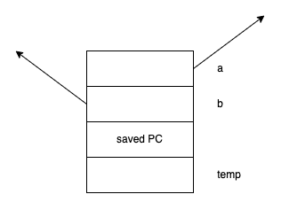

# Lec 11 

主要内容：

- c语言和c++代码在汇编层面上的一致性
- 引用和指针
- c++ 中的class 和struct
- 预处理：#define


## 1.引用和指针

**c版本的swap**

```c
void foo()
{
    int x;
    int y;
    
    x = 11;
    y = 17;
    swap(&x, &y);
}

void swap(int* ap, int* bp)
{
    int temp = *ap; 
    *ap = *bp; 
    *bp = temp;
}
```

**汇编代码**

```assembly
<foo>:
# 为局部变量申请空间
SP = SP - 8; 
M[SP + 4] = 11;	// x = 11;  
M[SP] = 17; 	// y = 17; 

R1 = SP; 		// &y
R2 = SP + 4; 	// &x
# 为函数参数申请空间
SP = SP - 8;
# 函数参数入栈 按照从右向左的顺序
M[SP] = R2;		
M[SP + 4] = R1; 
CALL <swap> 
# 回收函数参数的空间 参数清理工作
SP = SP + 8; 
# 回收局部变量的空间 局部变量清理工作
SP = SP + 8; 
RET;


<swap>:
SP = SP - 4;
# int temp = *ap; 
R1 = M[SP + 8];
R2 = M[R1]; 
M[SP] = R2; 
# *ap = * bp; 
R1 = M[SP + 12]; // bp
R2 = M[R1]; 	 // *bp
R3 = M[SP + 8];  // ap
M[R3] = R2; 	 // *ap = *bp
# *bp = temp; 
R1 = M[Sp + 12]; 
R2 = M[SP]; 
M[R1] = R2; 

# deallocate space for temp 
SP = SP + 4; 
RET; 
```

**C++ 版本的swap**

```c++
void swap(int &a, int &b)
{
    int temp = a; 
    a = b;
    b = temp;
}
```

编译器对引用的实现实际上是对指针进行自动的解引用【左值引用】

```cpp
int x; 
int y; 
x = 11; 
y = 17; 
swap(x, y); // 按照引用的方式来传递，但编译器最终会传进来地址，x，y
			// 必须是左值，即内存中要有对应的地址。  
```

​	虽然我们再代码中对引用的使用，看起来像是它们都是直接的整形变量。 但是在内部的事项上它们并不是真正的整数。

**汇编代码**

```assembly
# 在CS107的汇编代码中，与c代码的汇编在细节上一致
<swap>:
SP = SP - 4;
# int temp = *ap; 
R1 = M[SP + 8];
R2 = M[R1]; 
M[SP] = R2; 
# *ap = * bp; 
R1 = M[SP + 12]; // bp
R2 = M[R1]; 	 // *bp
R3 = M[SP + 8];  // ap
M[R3] = R2; 	 // *ap = *bp
# *bp = temp; 
R1 = M[Sp + 12]; 
R2 = M[SP]; 
M[R1] = R2; 

# deallocate space for temp 
SP = SP + 4; 
RET; 
```

​	编译器看到函数调用，但是在调用中并不会对x和y求值，因为根据swap函数原型，应该将它们的引用传递进来。引用的实现是为了：让swap函数返回后，x，y的值都被更新了。**那么函数只有知道x，y的地址，才能修改x，y的值。**



​	从内部实现上来看，a，b参数的两个位置存储了两个指针，编译器知道当引用传递的时候，实际上传递的是指针。并且为用户自动对这些指针进行解引用操作。因此这个函数的汇编代码与c语言指针版本的汇编代码完全一致。无论指令还是偏移量，都是完全一样的。

​	 虽然在传递参数时候没有加上&，但是编译器会根据函数原型找到线索，然后理解这里应该传入的是一个引用类型。引用只是用地址传递参数的一种方式罢了。 

```cpp
int x = 17; 
int y = x; 

int &z = y; 	// int占用的内存并不大。
```

​	这个图和实际的编译代码的方式相关，因为编译器最终将为z留出的空间，与y的地址联系了起来。


```cpp
int x = 11;
int y = 17; 

int *z = &y;
```


如果引用就是指针的话，那么为什么还需要实际的指针呢？

**引用**

​	引用的确很方便，尤其会给人们一种假象，将这个名字作为其他某个地方声明的变量的别名。但是对于引用的话，一旦赋值就不能将引用重新绑定给新的左值。但是对于指针你是可以随时改变的。所以使用链表是没有办法很容易构造出链表的。所以这也是指针仍然能在C++中占有一席之地的原因。

**返回引用**

​	返回引用意味着在内部返回一个指针，但是编译器不会按照对待指针的方式处理返回值，【最好假设它返回的是一个真实的字符串，而不是一个char*；返回的是一个int，而不是int类型的指针，并且像变量一样对它们进行操作。但是在内部来看，实际上它是某个位于内存其他位置的int / string 变量】

**引用的实现**

​	引用的某些实现并不是完全靠编译来实现的。并且引用相关的汇编代码的生成与函数的调用执行和返回的方式不尽相同。在C++语言级别上引用与指针有着不同的语义，只不过实现起来的汇编代码比较像罢了。


## 2.类和结构体 类方法

结构体和类实际上是是以相同的方式存储在内存中的，不仅是本质上相同，甚至可以说是完全相同的。

在C++中，struct 中可以有构造函数，析构函数和方法的。和类一样，类可以不定义任何方法。

在C++中结构体和类的唯一区别在于默认的访问修饰符：struct 默认是public的，

class默认是private的。

编译器几乎将这两个语法结构等同对待，它们不同之处在于在最开始有一个转换语句,它会问这样一个问题：“这是一个结构体声明还是一个类声明？“然后根据结果对没有制定访问控制的变量默认为private or public 

来看这样一个类的定义：

```cpp
class binky
{
public: 
	int dunky(int x, int y);
    char* minky(int* z)	// inline impliment
    {
        int w = *z; 
        return slinky + dunky(winky, winky); // 等价为return this->slinky + dunky(winky, winky); 
    }
    
    
private: 
    int winky; 
    char* binky; 
    char sinky[8];
}; 

binky b; 
```

每当你声明一个这种binky类型的记录，不出意料地，你会得到 一块内存，里面紧挨着存放着3个成员域。这里成员放置的顺序和我我们之前讲的一样。对于所有的对象来说：winky都是在blinky之前声明的。然后在最上面是8个字符的数组。 

**变量b的内存结构**


 这种变量的放置方式和结构体中变量的放置方式相同。winky的偏移量为0，binky在winky之上，slinky在blinky之上。binky是指针，占4字节，指向外面的内存，slinky是一个嵌在结构体/类定义中的数组。也正是因此它占据最上面50%的内存空间。

**关于this指针**

调用minky函数时为什么能够访问winky，slinky这样的类成员变量呢？因为这个函数知道要操作的对象的地址。**this**指针总是作为第-1个参数或者第0个参数（取决于你的三观）。从用户的角度来说这个参数时隐式传入的。我们在实现c的泛型时总是要将被操作的结构体的地址传给函数【】，作为显式的第0个参数。在C++中则不用这么麻烦了。

因为如果你使用这种记号

```cpp
int n = 17; 
binky b; 
b.minky(&n); 
binky::minky(&b, &n);// 实际上是这样的,这个函数的命名很精妙，我们可以通过命名空间来确认minky是定义在						 // binky中的 汇编层面的代码是按照这句来翻译的。
// 汇编代码会为int w 申请空间 SP = SP -4; 
// 实际上C++编译器会对代码准入上进行一些优化。它会为某些c++特性注入引用，对象的某些传统方法进行调用等。
```

编译器会发现这是面向对象的代码，实际上调用minky函数传入的参数不是一个，而是两个，对象的地址隐式地被传入了这个类方法。编译器会将某个binky类对象/结构体的地址传进去，作为函数的第0个参数。 

当编译器看到`b.minky(&n)`时，它会说，okay，我知道这条语句的意思，这是一条面向对象的语句（OO），但是它实际上也是要调用一段代码的。在这里就是调用类中的minky函数。然后不仅要将&n作为显式的参数传入，在它之前，还要传入调用它的对象的地址。因此活动记录在类的所有普通方法调用中是普遍存在的，只是比你看到的多一个参数。

**类方法minky的活动记录**


现在这个函数活动记录中需要记录更多的信息：但是只要你理解了k个参数的成员方法，其实k个参数的成员方法其实就是调用k+1个参数的函数，其中第0个参数传入的是this指针。

当我们从范式的角度去考虑这个问题的时候，我们就不再比较c和c++之间的相似之处了。但是当我们书写汇编代码的时候，我们会说：“现在我想要对c的结构体，以及函数，和c++的对象以及成员方法使用相同的代码生成策略。“那么这个时候你可以使用完全相同的代码生成策略，对于结构体和类型，函数指令代码，和代码返回，通过过将k个蚕食的成员方法，看成是k+1个参数的函数。并且第0个参数总是某个调用方法的对象的地址。 

从内部实现上来说，当进行函数调用时，实际上会跳转到`binkey::dunky`方法对应的标号。而实际上参数占用了12字节的空间，8字节是两份winky的拷贝，还有就是this指针的值。由于在函数名之前没有指定调用对象，因此编译器会将this的值传入。然后复制到栈中

**考虑如下的minky:**

```cpp
class binky
{
public: 
	int dunky(int x, int y);
    char* minky(int* z, binky& d)	// inline impliment
    {
        int w = *z; 
        return slinky + d.dunky(winky, winky); // 等价为return this->slinky + dunky(winky, winky); 
    }
    
    
private: 
    int winky; 
    char* blinky; 
    char slinky[8];
}; 
```

binky类型的对象d引用的地址将会作为活动记录的一部分传递给成员方法dunky。

在进行C++编程时，你认为你是专注于数据的，并且在C编程时，你使用动词命名的函数或者专注于处理过程。对于编译器来说它们只是不同语法形式的同一事物。这些不同形式的代码最终都变成了汇编代码指令流，指令会被顺序执行，偶尔执行跳转指令以及返回指令。并且编译器可以保证完成面向过程C程序员和面向对象的C++程序员想要做的事情。

## 3. static 静态成员函数

static 关键字有75种意思，再加一种：修饰静态成员函数

当使用static这个关键字修饰类中方法的时候：

```cpp
class fraction
{
 public: 
    fraction(int n, int d = 1);
 	void reduce();    
 private: 
    static int gcd(int x, int y); 	// 这个函数只和fratcion类有关
};
```

实际上只是将两个参数传入gcd函数，和普通的函数没有任何区别。在这个函数中，不需要this指针，也没有保存this指针。

C++ 中的静态成员函数意味着调用它的时候，并不需要类的实例作为参数，你可以将它当作一个单独的函数来进行调用。实际上它确实是一个普通函数，只不过它的作用域是在类定义中的。就好像类的namespace那样。

静态方法由于它们不需要将这个隐式的this指针传递进来，因此从内部原理上看它们被看做是普通函数。

因此如果我想定义属于自己的执行函数，或者比较函数。如果这个函数并不是普通函数，而是类中的一个static方法时，也可以正确执行。比如可以将一个static方法传给bserach。

 要注意的是static会影响c++的继承特性，你并不能继承类中的静态方法。当继承类调用静态方法时，并不能得到正确的结果。

因此static修饰类成员函数并不常用。

这是因为这些方法根据类对象的不同，而会有不同的反应。

## 4. 预处理，编译，汇编，链接

**编译和链接的细节：预处理器**

预处理器一般用来处理`#define` 和 `#include ` 预处理指令，然后才真正的调用所谓的编译器。编译器负责将你的.c文件以及.cc文件编译生成对应的.o 文件 。这些文件在你输入make命令之后，就会在你的目录下生成。然后在编译之后，还有一件事情，使用IDE是不会察觉到的，因为使用IDE生成的是可执行文件。但是当.o文件被生成之后，并且其中一个.o文件中包含main函数，在生成最终的可执行文件之前还有被称为**链接**的关键一步。

链接器会将一系列.o文件按照一定顺序排列起来，并且确保在执行过程中，任何调用的函数都能够从.o文件中找到。在这之后生成一个默认名为a.out的可执行文件(assembly.outfie)，这是所有.o文件的打包整合。

为什么`call <swap>	`不直接写成PC的偏移量形式呢？而是使用一个占位符？这样就可以直接跳转到swap函数的跳转地址了。其实当链接阶段结束之后，的确变成了上述描述的那样。因为所有的符号在可执行文件创建之后，都已经有了明确的地址。如果链接器知道每一个.o文件中的所有符号。以及这些.o文件是怎样。并且.o文件按照一定顺序排列。链接器就可以移除这些符号，并替换成`PC + offset` 的形式。

#**define**

使用纯c编程，想要声明一个全局变量。常用的方式是#define预处理命令来定义一些有意义的全局名称。magic number or magic strings 

```c
#define kWidth	480 
#define kHeight 720 
...; // code 

printf("Width is %d\n", kWidth); 
int area = kWidth*Kheight; 
' '
```

当你将.c文件传给GCC或者G++作为参数时，在GCC或者G++中有一个名为预处理器的组建。它其实和编译不太相关。并不参与程序的编译。实际上它会一次读入你传入的.c 的内容， 从上到下，从左到右地。

每当遇到#define的时候（它其实只关心这个关键字#define），通常它将读取这一行。如果每一行的开头都没有#符号的话，于是也就相当于没有#define和#include，编译器会认为：这一行没有预处理相关的内容。不需要具体关心。于是直接将输入的内容作为输出即可。

当读取到了#开头的一行时。预处理器内部的hashmap，将kWidth作为key，将480作为value，预处理器甚至不知道480是一个数字。它认为：“在kWidth后面的空格开始，在这之后的第一个语法符号之间的内容作为这个标识符kWidth对应的文本内容。

在预处理器继续读入的时候，当遇到hashmap中存在的key时，就会将这个key替换成为value，当然除了字符串常量中出现的符号，而是代码的其他部分中的符号。预处理器会将key替换成为value，就好像你原本在那里写的就是value一样。

如果不使用#define的话，在源代码库中可能会出现很多次magic number,当你想要修改图像的宽和高时，就需要手动一处一处地进行修改。所以#define要比手动搜索修改要好一些。

预处理器的职责：

​	将.c文件的内容读入。将结果输出到同一个.c文件。但是去掉#define, #include等预处理指令。并且#define所带来的副作用也会影响到输出的结果。

```c
# 预处理之后的.c #define 去掉了，并且进行了文本替换。
printf("Width is %d\n", 480); 
int area = 480*720; 
```

当它们作为数据传到下一个阶段，即编译阶段的时候，编译器会将这些内容抽出来，并且发现它们时数组常量。并在这个阶段进行乘法操作。


Q&A:

实际上编译器会将kWidth作为另一个独立的记号，只有在完全匹配的时候才会进行替换，如果出现了kWidth_2这样的记号，将不会被替换。

magic number 的概念，#define将一个名称和一个magic number联系了起来

```c
#define kWidth	480usx
#define kHeight 720anx 

printf("Width is %d\n", kWidth); 
int area = kWidth*kHeight; 
```

编译器只是进行简单的文本替换，不知道这代表着什么内容。到了编译阶段时，编译器会发现这个错误并停止编译。
