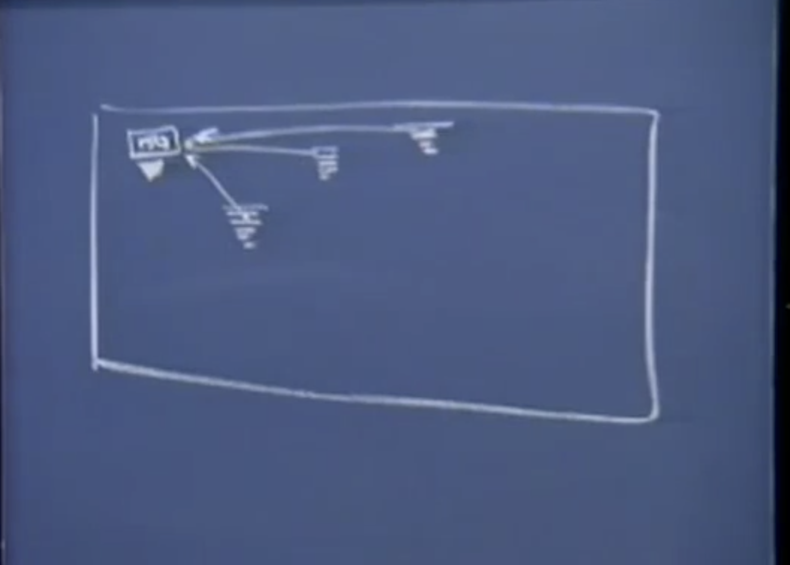

# Lec 15

TicketAgents:

1. 顺序执行
2. “看起来同时运行”
3. 线程之间共享资源
4. 如何解决线程间共享资源的问题

## Ticket Agents 模拟

### 1. 顺序执行的模拟程序

上次课程中提到的模拟航班售票的程序，与上次的程序有少许变化

```c

void sellTickets(int agentid, int numTicketsToSell)
{
    while(numTicketsToSell > 0)
    {
        printf("Agent%d sells a ticket\n", agentNo);
        numTicketsToSell--;
    }
    
    printf("Agent%d: All done!\n", agentNo);
}


int main()
{
    int numAgents = 10; 
    int numTickets = 150; 
    
 
    for(int agent = 1; agent <= numAgents; agent++)
    {
        sellTickets(agent, numTickets/numAgents);
    }
    
  
    return 0; // returns 0 to satisfied compiler 
}
```

为什么这个程序不能很好的模拟现实生活？

因为这个程序是顺序执行的，而在实际生活中在售票处2有任何动作之前，售票处1有可能会卖完所有的15张票。按照模拟程序的逻辑，每个agent 会有16行打印，并且按照agentid升序排列。

实际生活中所有的15个售票处同时进行卖票并且是以合作而非竞争的方式同时销售总共的150张票。

而且每个售票处卖票的数量也不能只是简单的numTickets/numAgents，虽然这样所有的150张票都会被卖掉，但是，但我们这样做是顺序执行的：1->2->3....->10

我们需要建立的模型是这样的：

所有的agent遵照同样的函数，按照相同的步骤来销售这些票，但是它们看起来应该是同时运行着，而不是按照固定的顺序。

### 2 “看起来同时进行”的模拟程序

我们需要使用线程库，在C 和 C++ 标准中，线程包和库来支持我们在这里所做的。

这15个ticket agent 每个都看起来像是跑道上的狗一样，我们要做的事把门打开，它们之间不会相互竞争。并且它们会到达终点。所有的线程都会遵循这个规则。当它们全部完成的时候，所有的工作也将完成。

```c
void sellTickets(int agentid, int numTicketsToSell)
{
    while(numTicketsToSell > 0)
    {
        printf("Agent%d sells a ticket\n", agentNo);
        numTicketsToSell--;
    }
    
    printf("Agent%d: All done!\n", agentNo);
}


int main()
{
    int numAgents = 10; 
    int numTickets = 150; 
    
 
    InitThreadPackage(false);       // cs107 package 中的线程库函数 false 表示不打印debug info
    
    for(int agent = 1; agent <= numAgents; agent++)
    {
        char name[32];      // 区分不同的线程
        sprintf(name, "Agent %d Thread", agent);
        ThreadNew(name, sellTickets, 2, agent, numTickets/numAgent);        // 创建线程，所有的狗站在了起跑线上
        if(RandomChance(0.1))
        {
            ThreadSleep(1000);  // 暂停使用处理器至少1s
        }
    }
    RunAllThreads();    // release the dog， 让狗子们跑起来 block 函数，当所有的线程执行完毕后返回
  
    return 0; // returns 0 to satisfied compiler 
}
```

Q&A:

1. 在这个例子中ThreadInit, ThreadNew 都放在main 函数中执行更方便些
2. 事实上在运行线程之前，必须先执行InitPackage，并设置好所有的线程。无论是在main 中还是通过子函数 RunAllThreads 实际上起到引导线程执行的作用。
3. 线程自己也可以创建线程，(spawn their own child threads) 有些荒谬的比喻是一只狗子在赛跑中然后生下三只小狗子，然后把三只小狗抛到起跑线然后对他们说“Please run”。😂 这类事件会产生一些很有趣的并发性错误。

### 调度：时间片分配

> 运行所有的线程，会让你有心跳的感觉，每次boom 之间都是在执行不同的函数，且它们通常通过循环调度[Round-Robin]的方式来获取两次心跳之间的时间片(time slice)。

每个agents 在自己的时间片里卖票。假如不加入随机化方法，那就和现实生活中的系统执行完全相同或者非常接近。每个人在自己的时间片中几乎可以卖出相同数量的票。为了更接近现实场景，我们在这里引入一些随机化的过程。

Q：哪个线程在卖票？

A:  真正调用卖票的线程，ThreadSleep 只会被执行一次。但是一共有10个线程在等候执行这段代码，它们各自有自己的指针指向这段由编译器生成的代码。假如有一个线程刚好进入了ThreadSleep，其实就是陷入了这段代码中，然后被处理器暂停运行。甚至从Ready Queue 中被推出，放入到Block Queue中，直到指定的时间过去。

Q: 所有的线程都是这样执行吗？ 有没有一种机制来控制每个线程应该执行多少个循环？

A: cs107中使用的线程库不支持，多数线程库不会提供时间片持续时间的控制权，这样会产生不可预见的结果，比如一个线程执行了很长时间以至于其他线程无法获得时间片。但是java上的一些线程库可以附加优先级，通常会对线程的优先级进行排序，在优先级高的线程执行完成之前，优先级低的线程将不会有任何动作。但是我们现在没有，只需考虑所有线程优先级平等的这种情况。线程被轮流调度平等地占用处理器一段时间，除非有其他的事件阻塞了线程的运行。

按照上面的代码，打印的输出会是怎样呢？

你可能会先得到3条printf的输出

```shell
Agent 1 sells a ticket
...

Agent 2 sells a ticket 
Agent 3 sells a ticket
[5times]

....
Agent 7 All done! 
Agent 8 sells a ticket 
Agent 8 All done! 
...
Agent 3 All done!
```

Q: 如果没有使用线程机制

A: 线程机制对于while循环没有任何的概念，它不会检测到循环跳转，并把这种跳转作为暂停线程占用处理器的信号，典型的时间片长度是100ms，但是在一个典型的时间片中很多票可被售出，如果打印来得及的话。有时候你会执行到一半，也许你正在执行printf，然后你失去了处理器资源，当线程重新获得时间片的时候，接着执行printf直到完成，返回并将票的总数减少。

Q:

A: 有些线程包允许控制时间片，但通常没有那么高的优先级。通常你不必在程序中通过线程来控制时间片的轮转。你只需要使用并发编程就可以了。 让线程管理器来决定哪个线程优先级最高。实际生活中如果agent2 - agent10长期被占用的时候（一直有人在打电话，占线）我们也并不想把agent1从Ready Queue中移出。代码中的逻辑也是。但是在模拟中，当其他agent都被阻塞的时候，你会让agent1 保持售票状态。

Q：ThreadSleep 让线程从运行状态变成阻塞状态，等待一段时间后放到Ready Queue 等待继续运行。

A： ThreadSleep代码是被10个不同的线程调用的。代码本身只有一份。

Q：线程初始化之后直接就运行吗？

A：先初始化线程包，然后创建至少一个线程，来运行以确保所有需要做的工作已经全部就绪，并且是以并行而不是串行的方式。然后调用RunAllThreads() 来让所有线程开始运行。

Q:

A: main threads 也是一个线程，因此作为串行执行的一部分（它其实不是串行的，因为它碰巧仍然在一个线程中，而这个线程恰巧是main thread，而不是子线程中的一个），子线程是由main 线程产生的。

Q:线程并不知道它是否在while loop中，那么它是否知道它在执行某条指令中？

A:这是今天课程最有趣的部分。对于代码生成我们已经有了足够的了解。`numTicketsToSell--;` 这条指令并不是一个原子操作。它看起来像是一个原子操作。但是实际上是对局部变量的修改，对应三条汇编语句的表示 load-alu-store. 线程并不知道执行的汇编代码具体是做什么的，c代码并不是原子性的。因此当线程失去处理器使用权时，它可能正好处于这三条语句执行之前，执行之后，也有可能正在执行着三条汇编语句中的某一条。

### 原子操作

> 原子(atomic)本意是"不能被进一步分割的最小粒子"，而原子操作(atomic operation)意为"不可中断的一个或一系列操作"。要么完全被执行，要么就回滚，一点也不执行。

~~线程可能在做--操作时失去了处理器的使用权，等它后来重新占用处理器的时候~~

线程库在线程间搜索，这个动作由优先级高的线程进行，它总是能重新获得处理器的使用权，在每个时间片的末端.

Example:

​生成12个下载线程，所有的线程都去等待链接并且下载，由于在内核级别中有阻塞机制，线程会失去对处理器的控制，这是更加厉害的线程休眠。但是这里的休眠是有合理的理由的。因为线程和线程管理器都知道它可以更好的运行，所以当线程等待连接时，它就会失去对处理器的控制权。假设12个线程结束的时间都和网络连接有关。它们都排好队以这种方式依次进入管道中，这样会节省我们很多的时间【等待网络链接】。

### 3. agent 去访问共享的剩余票数量

每个售票点不会按照预先设定好的数量卖票，而是获取当前剩余票并进行售卖。

让这些agent访问同一个共享的整数

```c
void sellTickets(int agent, int* numTicketsp)
{
    /* critical region */
    while(*numTicketsp > 0)
    {
        *(numTicketsp)--;
    } 
    /* critical region */
    
}


int main()
{
    int numAgents = 10; 
    int numTickets = 150; 
    
 
    InitThreadPackage(false);       // cs107 package 中的线程库函数 false 表示不打印debug info
    
    for(int agent = 1; agent <= numAgents; agent++)
    {
        char name[32];  // 区分不同的线程
        sprintf(name, "Agent %d Thread", agent);
        ThreadNew(name, sellTickets, 2, agent, &numTickets);    // 创建线程，所有的狗站在了起跑线上
        if(RandomChance(0.1))
        {
            ThreadSleep(1000);  // 暂停使用处理器至少1s
        }
    }
    RunAllThreads();    // release the dog， 让狗子们跑起来 block 函数，当所有的线程执行完毕后返回
  
    return 0; // returns 0 to satisfied compiler 
}
```

所有的线程都拥有一个指针numTicketsp 指向numTickets 变量，初始值是150



假设这样一种情况，

1. agent1 看到还剩下了一张票，然后进行卖票，但是还没有来得及对这个线程间共享的变量完成减1的操作时就耗尽了时间片
2. Agent2 看到还剩下一张票，并执行了同样的操作，于是它试图对共享的变量进行减1 的操作。但是也没来得及完成就耗尽了时间片。
3. 相似的事情也可能发生在其他的线程中。
4. 当每个人都试图卖掉最后一张票的时候，这简直太可怕了。
5. 当线程重新获得时间片运行时，它们不会重新检查之前执行的过程。所以他们都试图减少这个共享的全局变量。这样这个变量就可能会变成-9，这是一个典型的并发导致的问题。

### threads are sharing resource

它们都依赖于共享的 内存数据，如果它们不注意操作这些数据的方式，在执行操作的过程中中途退出，并且线程要根据这个共享数据进行判断，这样当它失去处理器的控制权时，全局数据的完整性就被破坏了

### critical region

当进入这个区域并且对线程共享的资源执行操作时，没有其他线程能够进入到这个区域
在本段代码中并没有语句表明 告知其它线程“我在critical region 中，你们不可进入”，所以必须有一些语句放到critical region 的位置以便阻塞其它线程，以及执行出critical region 时解除对其它线程的阻塞。
在任何时候我们都希望只有一个线程在critical region中

### 4. 使用Semaphore限制对临界区域的访问

信号量:

在编程中semaphore作为一个非负整数发挥作用。它支持➕1和➖1原子操作功能。

​不允许信号量维护的值编程负数，如果SemaphoreWait 发现信号量为0, 它不会把信号量变成-1 它会执行"block"动作，把信号量阻塞起来，这时他就会暂停占用处理器资源。显然，它知道自身处于等待状态，并且一直等到其它线程做了SemaphoreSignal 动作。

```c
SemaphoreWait(lock);    // -1
SemaphoreSignal(lock);  // +1 
```

它们只是利用硬件或者汇编指令改变维护的整数的值

```c
void sellTickets(int agent, int* numTicketsp, Semaphore lock)
{
    while(true) // 不能再在while中做判断了，因为随着处理的深入，我们不能保证此处判断的结果正确性
    {
        SemaphoreWait(lock);
        if(*numTicketsp  == 0) break; 
        
        (*numTicketsp)--;
        printf("--------\n");
        SemaphoreSignal(lock);
    }
    SemaphoreSignal(lock);  // 对应break
    
}

/*
    在循环中不停的lock unlock, 并且可能在对共享资源操作时失去对处理器的使用权，这样是很危险的，除非有信号量为0保证其他线程无法对共享资源进行操作。因为此时其他线程被阻塞在critical region 之前无法前进。

*/


int main()
{
    int numAgents = 10; 
    int numTickets = 150; 
    
    Semaphore lock = SemaphoreNew( , 1); // 信号量，初始值为1
    
    InitThreadPackage(false);   // cs107 package 中的线程库函数 false 表示不打印debug info
    
    for(int agent = 1; agent <= numAgents; agent++)
    {
        char name[32];  // 区分不同的线程
        sprintf(name, "Agent %d Thread", agent);
        ThreadNew(name, sellTickets, 3, agent, &numTickets， lock);// 加一个参数，将lock 传给线程
        if(RandomChance(0.1))
        {
            ThreadSleep(1000);	// 暂停使用处理器至少1s
        }
    }
    RunAllThreads();    // release the dog， 让狗子们跑起来 block 函数，当所有的线程执行完毕后返回
  
    return 0; // returns 0 to satisfied compiler 
}
```

如果在执行的任何一个时间点，该线程失去了处理器资源。其他线程操作了共享变量，那while（）之后的语句就没有意义了。

信号量的初始值为1 意味着资源只能保证最多1个线程来使用。

### 死锁

如果初始值设置为0，那就意味着所有的人都会被阻塞。所有线程走到critical region 之前都会认为有其他线程正在使用共享资源，然后每个线程都会处于等待状态。

如果将信号量的值设置为2，那就意味着允许有两个线程同时进入critical region，这两个线程会搞乱全局数据

Q&A 为什么会有两个SemaphoreSignal?

最后一个SemaphoreSignal 对应代码中的break 后执行的操作。

Q&A 有没有比信号量更加强大的方法，让线程不会在敏感的节点失去对处理器的占用？

实际上优先级就可以。着应该是线程管理器的任务。如果只有一个优先级很高的线程，那么就会一直让它运行直到它阻塞。