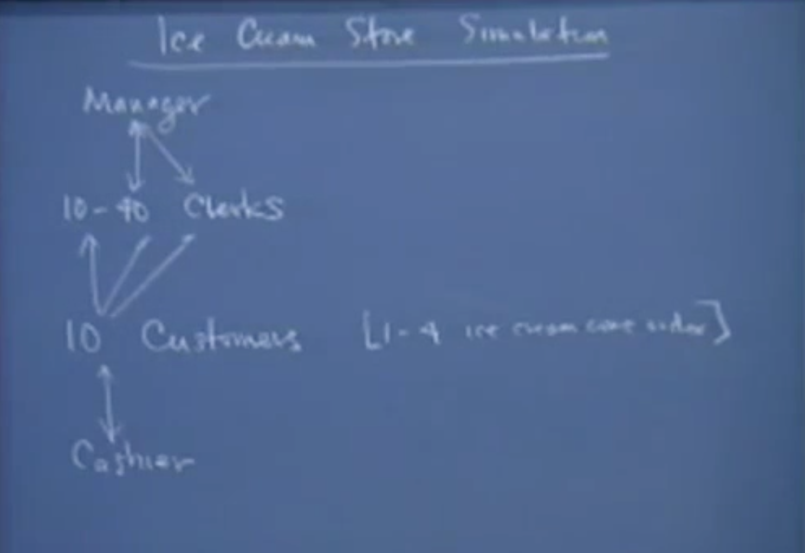

# Let 18 Ice Cream Store Simulation



Biggest Concurrency problem in CS107

## Roles

- 1 Cashier: deal the billing issues
- 1 Manager: at most one clerks in his office at the same time.
- Clerks: 10 - 40, before passing cone to the customer, then has to ask for manager for inspection to get an approval for the cone that he/she made. 
- 10 Customers: each one ask for a random number of cones from 1 to 4.

### Manager

1. Waiting all the time for the clerk's request
2. do inspection.
3. tell the clerk if the cone is qualified.

The manager will wait until all the cones for all the customers to be done.

### Clerks

1. No more than 1 clerk can go to the manager. some kind of lock in manager's office.
2. Ask for the manager to inspection the cone.
3. get the respond from manager that if the cone is qualified.

### Customer

1. comes in, and he want 1 - 4 ice cream cones
2. fire N clerks, get all cones he wants.
3. go to the cashier in a line (so there is a kind of sort, first in first out, how to assure that?)

### Cashier

1. Waiting for customers(in a line) to request the service.
2. handling the customer's billing 

## Code

### main function

```c
int main(int argc, char** argv)
{
    int totalCones = 0;
    InitThreadPackage();
    SetupSemaphores();
    for (int i = 0; i < 10; i++)
    {
        int numCones = RandomInteger(1,4);
        ThreadNew(_, Customer, 1, numCones);
    	totalCones += numCones;
    }
    
    ThreadNew(_, Cashier, 0);
    ThreadNew(_, Manager, 1, totalCones);
    RunAllThreads();
    FreeSemphores();
    return 0;
}
```

### global variables

```c
// for manager and clerks
struct Inspection
{
    bool passed;	// init as false
    Semaphore requested;	// init as 0, clerk finish cone and then signal the semaphore to wake up manager.
    Semaphore finished;		// init as 0, manager finish the inspection and then siganl the semaphore to wake up clerk.
	Semaphore lock;			// init as 1, only one customer can get in the office.
} inspection;

struct Line;	// see definitions in Cashier's code part
```

### Manager

``` c
void Manager(int totoalConesNeeded)
{
    int numApproved = 0;
    int numInspected = 0; 
    
    while(numApproved < totalConesNeeded)
    {
        SW(inspection.requested);
        nunInspected++;
        inspection.passed = RandomChance(0, 1);
        if(inspection.passed == true)
        {
            numApproved++;
        }
        SS(inspection.finished);
    }
}
```

### Clerk

```c
void Clerk(Semaphore semToSignal)
{
    // make cones until passing the manager's inspection
    
    bool passed = false;
    while(!passed)
    {
      	MakeCone();
        SW(inspection.lock);		// binary lock.
        SS(inspection.requested);	// signal manager to inspect
        SW(inspection.finished)		// waiting for manager's result.
        passed = inspection.passed;
        SS(inspection.lock);
    }
    // give cone to customer
    SS(semToSignal);
}
```

If we don't have the lock, what happens?

- struct inspection is shared between all clerks and the manager
- if we don't have that lock, the `passed` belongs which Clerk?
- Imagine one clerk thread was pulled off from the processor before `passed = inspection.passed`, it is very possible that some other clerk thread could get into the manager's office, show him his cone, get his `passed` value. This is the same problem of `ticket agents`

What if the manager SemaphoreSignal and SemaphoreWait ?

Which means the door of the office would be opened, any other clerk could get in and override the `passed` value before it close. In another way, **we only have one manager thread**, the manager will always pass SS, and in the end SW.

Why do we need `inspection.requested` and `inspection.finished`? 

The manager is waiting on clerk's request, the clerk sends a request, and then wating on manager's inspection done. This is same with Ringbuffer problem.

### Customer

```c
void Customer(int numCones)
{
    BrowX();
    // get numCones
    Semaphore clerksDone; // 0
    for(int i = 0; i < numCones; i++)
    {
        ThreadNew(_, Clerk, 1, clerksDone);
    }
     
    // wait for numCones done
    for(int i = 0; i < numCones; i++)
    {
    	SemaphoreWait(clerksDone);    
    }
    SemaphoreFree(clerksDone);
    
   	WalkToCashier();
    
    SW(line.lock);	
    int position = line.number++; // get number in sequence
    SS(line.lock);
    SS(line.requested);				// ask Cashier for billing
    SW(line.customers[position]);	// get Cashier's response.
}
```

Why do we just use a single loop?

That would be sequential, we spawn a new thread, then wait for its done before we spawn another one.

Why do we just use a semaphore and a shared intager

Back to the problem of `test` and `use`. The main reason why we are using semaphores or locks or those basically concurrency constructs is that we need to ensure **atomicity**: we want to decrement the value or increment its value in one operation or in several operations that are guaranteed to be done atomically. Between `operation` and `test`, it could be pulled off from the processor.

In the second loop, which thread is being waiting?

Don't care to know which one signaled as long as you know that somebody just singnaled you.

### Cashier

A FIFO queue.

```c
struct Line
{
    int number;	// init as 0, next avaliable position in the line. 
    Semaphore requested; // init as 0;
    Semaphore customers[10];	// init as 0; waiting to be served.
    Semaphore lock;				// init as 1;
} line;
```

Something missed?

`number` is a shared resource between Customers, so it need to be protected by `lock`

```c
void Cashier()
{
    for(int i = 0; i < 10; i++)
    {
        SW(line.requested);
        Checkout(i);	// checkout customer i;
        SS(line.Customers[i]);
    }
}
```

How to ensure the sequence of first-in, first-out?

This is realized by lock and number of `struct Line`, the first one gets number 0, while the second gets number 1, and so on.
