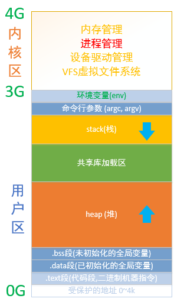
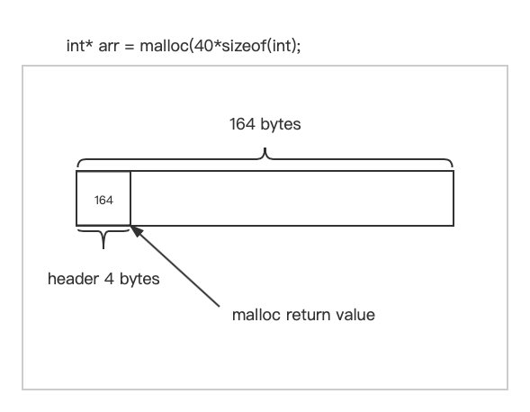
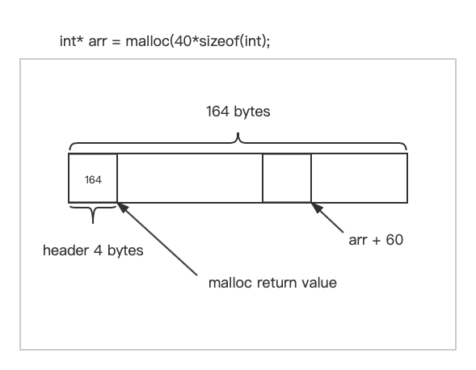
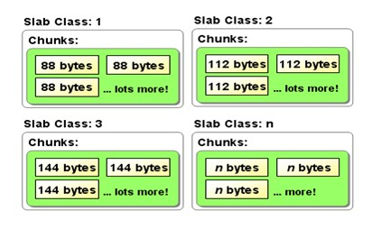
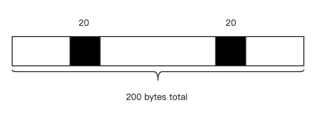
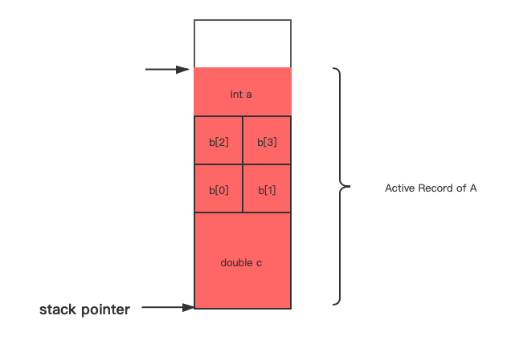
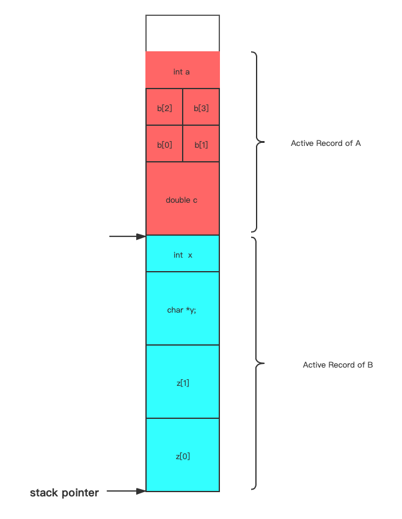
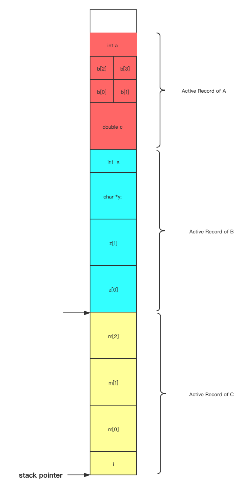
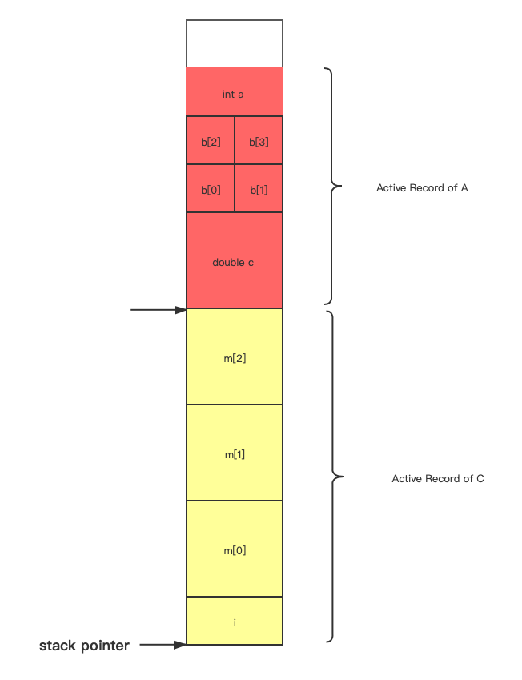
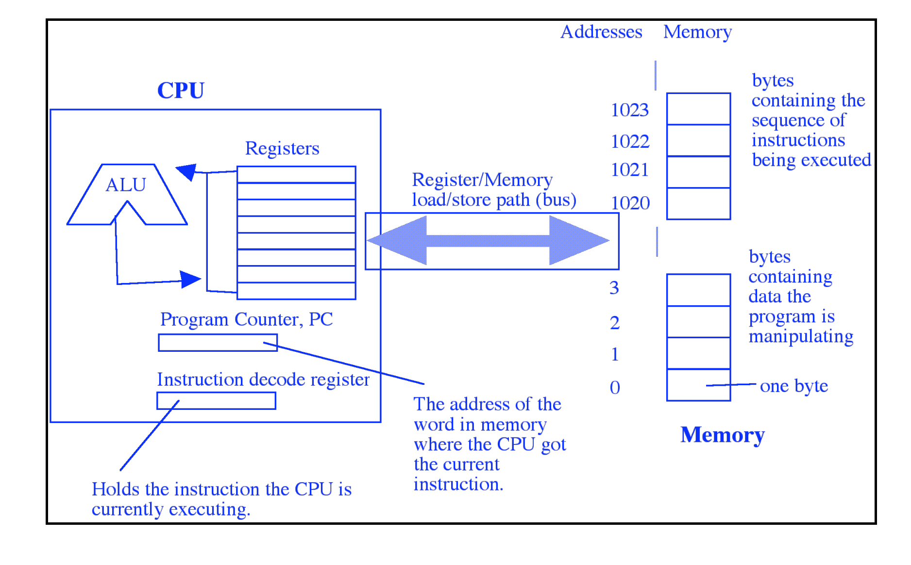

# Lec 8 堆和栈

主要内容：	

- 堆内存管理
- Malloc free 函数的实现思路
- 栈 

​	linux 进程空间模型:



## 堆内存管理 

​		

​	当程序被加载到内存时，堆的两个边界低地址和高地址被库代码用来实现malloc, free, realloc 部分,并且记录下来

​	`malloc` 函数用来分发堆内存的地址,在内部该函数记录了每个分配内存块的实际大小。这样调用free函数并传入地址时free能够精确地知道需要归还的内存大小。

​	malloc, free, realloc 是通过软件来实现，实现者可以使用他们想到的多种启发式策略，来让这些函数能够正确运行的同时保证尽可能的快速且高效。


## 启发式策略和堆管理器实现原理

```c
int* arr = malloc(40* sizeof(int)); 
```

​	看上去得到了160字节的空间，实际上管理这块空间需要额外的空间开销。



​	将指针作为参数传递给realloc或者free，该指针应该之前被malloc或者realloc函数调用处理过，这样才是合法的。

​	内存中留出的空间实际上是要大于申请的字节数。

​	在malloc函数返回分配的地址时，函数可能会预留出164字节或者168字节的空间（也可能是176字节或者192字节，这与规范有关），多出的这部分位于160字节之前，这段空间（header）用于记录该块内存的大小。

​	将malloc 返回的地址传给free函数，free会假设这个地址已经被正确的处理过，是一个合法的地址，那么就可以通过额外的header中记录的内存大小。

​	可以void* 强制转换为其他指针类型，退回4个字节或者8个字节来访问header中的内容。通过header的格式来解释这4字节或者8字节的内容->164 这段内存将归还给heap。

```c
// why they don't work
int* arr = malloc(100*sizeof(int));	// 404 or 408 bytes 

// 假设只使用了60字节的空间, 剩余的空间想归还给heap 错误的调用方式
free(arr + 60);
```

​	

​	将这个地址传给free，free的实现可能非常原始并且不进行错误检查合法性。malloc，free，realloc都是本着尽可能快速执行的原则实现的，因此不会对传入的地址进行检查。因为它们都假设你是非常擅长C和C++编程的。因此不会在调用时进行错误检查。 

​	free函数执行时只会回退4或8个字节，无论下标58和59里面一个int 或者两个int是什么，函数都将它解释称header中的内容，假设这里面存储的是实际分配的空间大小。按照这个空间大小向后找到一段内存并且使用内存释放算法。

```c
// 在栈上分配内存
int arr[100]; 

free(arr); 	
```

​	如果free函数不进行任何错误检查的话，当然free函数没有义务去做这些错误检查，以确保这个地址是被malloc 或者 realloc返回的。函数只会从arr的地址回退4或者8个字节，无论里面的内容是什么都将被按照header的格式进行解释。即内存块的大小。将这段内存归还给堆，以便对可以对其分配。 

### 实现：不进行错误检查

​	执行最快的实现方式就是对这些函数不进行错误检查，由调用者来保证

### 实现：记录分配的地址，进行错误检查

​	有些实现的确会进行错误检查：它会记录下已分配的void* 指针。并且通过将传入的参数与保存下来的void* 对比进行快速检查。以确保传入的地址是记录下void* 中的一个。在debug模式下，如果地址不合法，程序会报错。如果在release模式下地址不合法，编译器会忽略错误并且不会释放这块内存，因为这样做的话之后会出问题。 

### 实现： 按照2的幂次将内存分段



​	另一种实现方式，是将heap中的内存按照2的幂次进行分块。 如果申请的内存 <=8 字节，将在第一个区域中分配8 字节内存返回地址给调用者；如果申请的内存在(8, 64] 之间，会在第二个区域中分配64字节内存返回地址给调用者。即函数不会每次都分配精确的空间大小，因为这样会做很多额外的工作。将大块内存切分成各个子内存段，这样就能更快速的管理内存，并且简介地组织内存段。

​	这样，当申请160字节空间时，实际上分配的可能是192字节或者256个字节，具体取决于实现。

​	虽然如此，我们只能保证这160字节的空间是我们可以使用的，因为实现的方式不止这一种。 

#### 数组的边界溢出问题

​	如果从后向前遍历，越过了边界访问了arr[-1] 元素，它里面实际上时malloc 以及 realloc 写入的分配内存块大小的信息。

​	如果访问内存的时候，从后向前遍历并清零，越界将arr[-1] 中malloc留下的信息修改成了0。这样free和realloc函数将不能正确的执行任务。

### 实现：不仅记录内存块的大小，而且记录下一块空闲内存块地址。


​		通过这样的实现可以对realloc进行一定程度的简化和优化。当调用malloc和realloc时，函数希望能快速扫描堆中未使用的内存块。

​	函数通常会使用一个内存块的linked list 来记录空闲内存块。当malloc或者realloc函数调用时heap manager 都会遍历这个链表，找到满足要求的内存块。

​	一种简单的策略是选择满足请求的第一块空闲内存。即首次适配策略：从低地址开始搜索空闲块。

​	最佳适配：希望找到大小与malloc调用指定参数差距尽可能小的内存块。这样分配不会使用额外的内存。

​	最差适配： 扫描整个堆，找到可以使用的最大的内存块。

​	在malloc结束后记录指向哪里，这样在下次调用时从这个位置开始向后扫描并进行分配，保证堆的每个部分都能被访问到。

### 其他实现

​	在header中再保存一些信息来简化free和realloc实现

​	在释放内存时不会对其中内容进行清零，理论上可以这么实现，但是清空这些内存时需要花时间的。如果这块内存有1M大小，那么为何要对用户不再使用的空间中的信息进行清空呢？ 

​	有些实现不希望两个相邻的空闲内存块，而是将它们合并成一个大的内存块。相比于将整块内存打碎的方式，这样空闲链表会更加简洁灵活。

​	另一种实现：free 中仅记录了需要释放的地址，在下一次malloc或者realloc时将对应的内存进行释放。


### 内存碎片

	

​	虽然空闲块的总和满足条件，但是它们在内存中不是连续的，没有按照用户希望的方式聚在一块。

​	因此调用malloc申请100字节空间或者160字节时，malloc会认为分配失败并返回NULL。

​	是否通过内存搬移将已分配的内存紧凑排列，尝试将已分配的内存都放置在最前端。 这样有一个问题：malloc realloc已经将内存块的地址交给用户进行管理了。如果此时进行内存搬移，将导致用户访问错误的位置。

### 堆压缩算法

​	 Macintosh曾经使用了堆内存压缩的算法。 在堆中预留了很大的空间放置handler(`void**`) 并且维护一个`void*` 列表，返回的句柄距离实际的内存位置两个hops的距离，这样在进行内存搬移的时候修改(`void*`) 即可，用户仍然能够访问搬移后正确的内存块。

​	这个任务在后台由一个低优先级的线程进行。如果有命令强制执行压缩，或者空间不足，该线程的优先级会提升。不过堆内存的压缩和对堆内存的访问是不可以同时执行的。因为不能在内存块搬移过程中对内存块中的内容进行修改。  

```c
void** handle = NewHandle(40); 

// 告诉操作系统此时不要对当前的handle对应的内存块进行堆内存压缩操作，对其他的块可以进行内存压缩。
HandleLock(handle); 

//访问这块堆内存. 
visit(handle);


// 告诉操作系统此时可以对handle对应的内存块使用内存压缩操作
HandlUnlock(handle); 
```


## 栈 stack segment

​	通常在更高地址空间，程序刚刚开始执行时使用栈空间最小，是因为此时只用很少的活动函数。

​	通常，栈中被使用的部分大体上与活动函数的数量成比例。

```c 
void A()  
{
    int a; 				// 4 
    short array b[4];   // 8 
    double c; 			// 8 
    B(); 
    C(); 
} // 24

void B() 
{
    int x = 0;		// 4 	
    char *y = NULL; // 8
    char* Z[2]; 	// 16
    C(); 				
} // 32 

void C() 
{
    double m[3] = {0};	// 24
    int i = 0;  // 4
} // 32 
```

​	当调用函数A时，栈会为局部变量留出空间 具体留出空间的大小取决于cpu是32位还是64位，以及内存对齐模数。


### 活动记录/栈帧 

​	active record / stack frame 

​	假设A将被调用，指针将减去对应的大小，为函数中的局部变量留出空间，并且此时程序并不会失去A之前所有调用函数中的变量，它们只是被暂时挂起了。

​	

​	当A调用函数B和函数C时，会将栈指针再次减小为函数B和C中的局部变量留出空间。

​	这些指针实际上使用硬件存储，实际上它就是被称作stack pointer 的东西，并且总是跟踪指向最近调用的函数的活动记录。 

​	当函数A调用函数B，栈指针会继续减小,为函数B中的局部变量留出空间。函数B并不能访问上面的局部变量，因为它不知道上面是什么，只是碰巧在它上面，不过函数B能够访问对应活动记录中的变量。

​	

​	因为B又调用了C，栈指针会进行同样的操作。

​	

​	当函数C退出后，栈指针会上升，回到C调用的位置，C函数活动记录中的内容在栈中仍然存在，不过它已经不能被看到并访问了。

​	函数B返回，也是同样的操作，栈指针回到B调用之前的位置，好像并不知道函数B在最近被调用过一样。

​	此时调用函数C 它实际上将原来调用函数B时的活动记录覆盖了，当然C并不能解释B的活动记录中的内容，它甚至不知道函数B在最近被调用过。 C只是获得了可以认为是随机的值，如果想要正确利用这些空间，就要将它们初始化成有意义的值。 

​	


### 汇编代码如何进行栈操作

​	与堆空间相比，栈空间其实不是很大，尤其是在程序刚运行的时刻，大块内存都是运行过程中在堆中申请的。

​	计算机处理器的行为方式： load/store 结构	



​	通过cpu中的寄存器对数据进行存取，访问速度极快。技术上每个寄存器都可以从RAM中获取信息或者将信息写入RAM中。

​	ALU负责执行模拟我们能理解的加法，乘法，对比特位进行左移和右移等操作。通过寄存器来修改RAM中的值

​	另一种方式是让ALU与整个RAM连接，这样做要么价格非常昂贵，要么就是速度很慢（时钟周期变得很大）。会让二者之间的连接更加复杂，当硬件连接变得复杂时，通常时钟周期会变大。甚至不能对RAM 和寄存器中的操作数提供较多的运算。

​	所以通过load/store 方式在寄存器与通用RAM上传输数据，当数据装入寄存器中时，才会使用其中的数据进行运算，运算完成后再将结果写到RAM中。

1. 将RAM中的数据（无论是堆中的还是栈中的）装到寄存器中
2. ALU对寄存器中的数据进行运算，结果保存在另一个寄存器中
3. 将另一个寄存器中的结果写到RAM中属于它的内存。


```c++ 
void test() 
{
    int i = 7;
    int j = 10; 
    j += i; 
}
```


```assembly
# 编译器版本：ARM gcc 11.1 (linux)
push    {r7}
sub     sp, sp, #12
add     r7, sp, #0
movs    r3, #7
str     r3, [r7, #4]
movs    r3, #10
str     r3, [r7]

# j += i 对应以下四句汇编代码
ldr     r2, [r7]
ldr     r3, [r7, #4]
add     r3, r3, r2
str     r3, [r7]

nop
adds    r7, r7, #12
mov     sp, r7
ldr     r7, [sp], #4
bx      lr
```

​	硬件设计者希望在硬件级别上完成各种原子操作，并且还希望硬件可以运行的更加快速。


