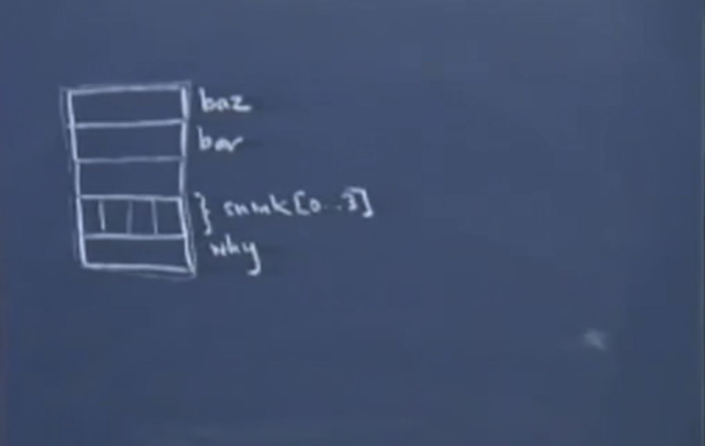

# Let 10 汇编 活动记录以及函数返回

主要内容：

- saved PC
- 函数调用过程中的函数的活动记录
- 函数参数入栈顺序和原因
- 函数返回的汇编细节


## 1. 真实的函数活动记录

为了简化，之前例子中所有的函数都没有参数。我们当时只考虑了局部变量，而函数的参数也是在函数的活动记录中存储。

考察这一个函数原型

```c
void foo(int bar, int* baz)	// 这些变量在哪里？ 
{
    char snink[4];	// 这四个字符打包为一个静态的数组
    short* why; 	// 紧挨着放置
    ;				// 不关心其他的代码
}
// 函数局部变量，函数参数都存储在相邻的内存中
```



为何函数参数按照从右向左的顺序而从高地址向低地址存放。

​	中间空白的空间存储着函数调用的某些信息。显然，foo函数会被main函数或者其他函数调用。甚至是foo函数自身（递归的情况）。因此我们要在这里记录下一些信息。以便告诉我们到底是哪块代码调用了foo，并且foo执行结束之后，该从哪里继续执行代码。

​	如果这个调用函数存在的话，那么这里依赖于saved PC值。这个值好像函数调用没有被指令流中断那样，在调用之后，要继续执行的指令地址