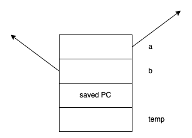
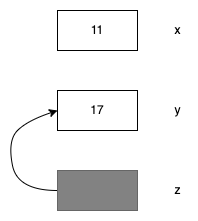
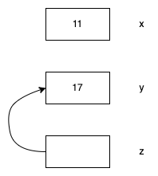

# Let 11 

主要内容：

- c语言和c++代码在汇编层面上的一致性
- 引用和指针
- c++ 中的class 和struct
- 预处理：#define


## 1.swap

**c版本的swap**

```c
void foo()
{
    int x;
    int y;
    
    x = 11;
    y = 17;
    swap(&x, &y);
}

void swap(int* ap, int* bp)
{
    int temp = *ap; 
    *ap = *bp; 
    *bp = temp;
}
```

**汇编代码**

```assembly
<foo>:
# 为局部变量申请空间
SP = SP - 8; 
M[SP + 4] = 11;	// x = 11;  
M[SP] = 17; 	// y = 17; 

R1 = SP; 		// &y
R2 = SP + 4; 	// &x
# 为函数参数申请空间
SP = SP - 8;
# 函数参数入栈 按照从右向左的顺序
M[SP] = R2;		
M[SP + 4] = R1; 
CALL <swap> 
# 回收函数参数的空间 参数清理工作
SP = SP + 8; 
# 回收局部变量的空间 局部变量清理工作
SP = SP + 8; 
RET;


<swap>:
SP = SP - 4;
# int temp = *ap; 
R1 = M[SP + 8];
R2 = M[R1]; 
M[SP] = R2; 
# *ap = * bp; 
R1 = M[SP + 12]; // bp
R2 = M[R1]; 	 // *bp
R3 = M[SP + 8];  // ap
M[R3] = R2; 	 // *ap = *bp
# *bp = temp; 
R1 = M[Sp + 12]; 
R2 = M[SP]; 
M[R1] = R2; 

# deallocate space for temp 
SP = SP + 4; 
RET; 

```

**C++ 版本的swap**

```c++
void swap(int &a, int &b)
{
    int temp = a; 
    a = b;
    b = temp;
}

```

编译器对引用的实现实际上是对指针进行自动的解引用【左值引用】

```cpp
int x; 
int y; 
x = 11; 
y = 17; 
swap(x, y); // 按照引用的方式来传递，但编译器最终会传进来地址，x，y
			// 必须是左值，即内存中要有对应的地址。  
```

​	虽然我们再代码中对引用的使用，看起来像是它们都是直接的整形变量。 但是在内部的事项上它们并不是真正的整数。

**汇编代码**

```assembly
# 在CS107的汇编代码中，与c代码的汇编在细节上一致
<swap>:
SP = SP - 4;
# int temp = *ap; 
R1 = M[SP + 8];
R2 = M[R1]; 
M[SP] = R2; 
# *ap = * bp; 
R1 = M[SP + 12]; // bp
R2 = M[R1]; 	 // *bp
R3 = M[SP + 8];  // ap
M[R3] = R2; 	 // *ap = *bp
# *bp = temp; 
R1 = M[Sp + 12]; 
R2 = M[SP]; 
M[R1] = R2; 

# deallocate space for temp 
SP = SP + 4; 
RET; 
```

​	编译器看到函数调用，但是在调用中并不会对x和y求值，因为根据swap函数原型，应该将它们的引用传递进来。引用的实现是为了：让swap函数返回后，x，y的值都被更新了。**那么函数只有知道x，y的地址，才能修改x，y的值。**



​	从内部实现上来看，a，b参数的两个位置存储了两个指针，编译器知道当引用传递的时候，实际上传递的是指针。并且为用户自动对这些指针进行解引用操作。因此这个函数的汇编代码与c语言指针版本的汇编代码完全一致。无论指令还是偏移量，都是完全一样的。

​	 虽然在传递参数时候没有加上&，但是编译器会根据函数原型找到线索，然后理解这里应该传入的是一个引用类型。引用只是用地址传递参数的一种方式罢了。 

```cpp
int x = 17; 
int y = x; 

int &z = y; 	// int占用的内存并不大。
```

​	这个图和实际的编译代码的方式相关，因为编译器最终将为z留出的空间，与y的地址联系了起来。




```cpp
int x = 11;
int y = 17; 

int *z = &y;
```

