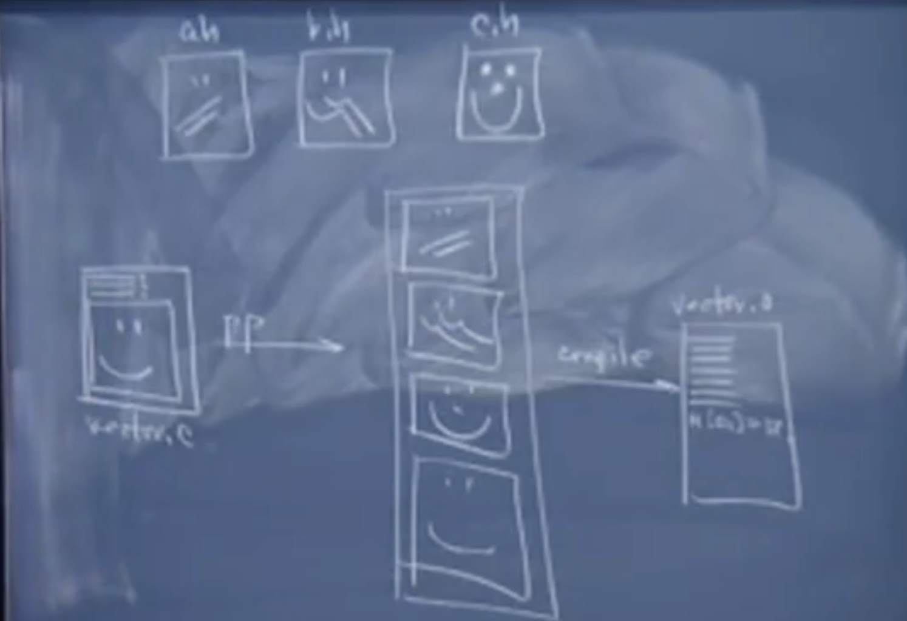

# Lec 12 

主要内容：

1. 预处理
   1. #define 常量
   2. 宏函数

2. 编译
3. 链接  


每个阶段都做了些什么事情？


## 1. 预处理器指令#define

**#define常量**

预处理只涉及文本的替换，而替换产生的问题会在之后的编译阶段识别，甚至会在运行时才体现。只是你不知道罢了。 

```c
#define kWidth 	40
#define kHeight	80
// 这两行之后只要出现了kWidth 或者kHeight 的话都会被进行文本替换，唯一的区别是#define 不会替换字符串常量。
#define kPerimeter 2*(kWidth*kHeight) 
// 会将kWidth 和 kHeight进行替换 2*（40+80）但是预处理并不会对其进行求值，而是将其看做文本，直到编译阶段才会进行求值操作。
```

#define进行大规模的查找和替换。这一预编译指令常用在纯C语言中。用来为某些常数或者常量字符串赋予一个有意义的名字。

**#define 宏**

对于#define 它还可以进行扩展。实际上可以像函数那样将参数传递给#define，这种形式的#define叫做宏

```c
#define MAX(a,b) (((a) >(b))? (a): (b)) // 只要中间没有空格，预处理就会发现这不是一个定义常量的#define

MAX(10, 40); // 当遇到这个表达式的时候，预处理去会找到这个MAX符号， 将a作为10，b作为40进行替换。因此在预处理阶段，这里会被替换成
((10) >(40))?(10): (40) // 这并不是用来指明40 > 10 的好方法，但是替换好的求值结果，就是你想要的答案。
```

和普通的#define一样，宏函数的写法就是实现内联函数的一种快速并且有点取巧的方式。当然你也可以使用函数来完成这一工作。但是从上周涉及汇编代码的课程中，我们就已经了解到，函数是需要调用和返回的。并且要为参数流出空间， 将参数值写入跳转到的函数地址。然后在执行完成后跳转回来。并进行清理参数这一系列工作。会花费很多的时间（在这里也许并不会花费太多的额外时间）大概也就是10条汇编指令左右。不过使用宏的话，这段代码也就是3-4条汇编指令。因此对这个函数来说。调用和返回的代码话费了总开销的70%。而这70%仅仅是用来处理函数调用和返回工作的。

因此，使用#define，可以将代码中使用了MAX 和两个参数的宏，高效地扩展成对应的表达式，在这里并不需要a和b都是整数。虽然看起来这里应该是整数。

```c
MAX(40.2, "Hello");	// 这样写最终会报错，但是在预处理阶段这么写不会有任何问题。
```

预处理阶段要做的事情就是进行模版化查找和替换。你会看到40.2替换了a，常量字符串"Hello"替换了b，所有出现在表达式中的b。而且只有在编译阶段，编译器才会读取这个扩展的表达式。并且分析它们的类型。然后说：“你直到不，我并不想对double类型和char* 类型进行大于比较“，因此最后会产生一个编译错误。 但是这个错误并不是在预处理阶段产生的。

Q&A：

宏并没有其所谓的返回值。这里只是一个表达式，它求值的结果是a或者b。

MAX的一个使用例子

```c
int max = MAX(fib(10), fact(4000)); //将这两个值中较大的作为求值的结果
```

预处理指令中的一些不足

对于MAX来说，只进行文本的处理和替换。因此这个宏辉调用某个函数一次，结果更大的函数两次，即更耗时的函数，会被调用两次。

展开后的结果

```c
int max = (fib(100) > fact(4000))? fib(100) : fact(4000);
```

fib如果使用的是二分递归实现，是相当耗时的，而fact的实现即使是线性递归也没有二分递归耗时。编译器不会为你保留中间的结果，它假设你就是想要这样执行。因为#define的宏定义就是你写的。

虽然从实现上来看这样写很低效。，至少在语义上来看这没什么问题。

更加高明的c程序员会尽量在一条语句中完成尽可能多的事情。比如他们希望MAX在比较变量的同时,对变量进行自增操作。

```c
int larger = MAX(m++， n++);
```

预处理阶段，根据宏定义进行展开

```c
int larger = ((m++)>(n++))? (m++) : (n++); 
```

那么，最终会对较小的变量进行一次自增，而对较大的那个变量进行两次自增操作。

于是你发现++一共执行了3次。因此返回值会比真正的那个值还要大1，并且会对较大的值进行两次加一操作。

当你写c语言时，有时候程序的执行结果总是和你的想法背道而驰，虽然用的熟练之后你会发现它的快速和简单

c语言诞生的时候编程信条是让程序员能够对机器做任何事，因此你甚至可以访问硬件。这种信条在当时并没有问题。1965年的时候代码库的规模相当的小。Unix也是在60-70年代写出的，可能比c语言稍微早一些。不过那个时候的程序特别的小且简单。而且最多不能超过64K，甚至是16K，也没有太多的程序，所以代码特别容易管理。不过现在接触到的代码库动辄上万行。大公司的代码库更是以百万计。你肯定不想通过二分法来排查1000万个文件来找出这样一个宏定义使用的错误。

于是你更加希望能在第一次写代码的时候就能将代码编写正确。但是这在c/c++中不太可能，所以我们一直在学习怎样编写正确的代码（😊）。

正是由于这个不足，所以更推荐用const static来定义全局常量

**#assert**

有些情况下需要假定的条件成立，比如说某个值大于0或者等于0或者<logicalLength，或者其他情况下 <= logicalLength, 并且调用VectorNth,你可能会被VectorNth函数实现中的最开始的assert语句block，停止继续执行。对于VectorAppend, VectorInsert来说，logicalLength是一个完全合理的参数，因此这如果在assert中检查到越界，那么两个函数会报错并终止执行。

因此要做的不是写一个函数来计算一块内存中第n个元素对应的地址，而是写一个#define的宏

 ```c
 #define NthElemAddr (base, elemSize, index) \
 		((char*)base + index*elemSize)
 ```

也可以将它写成函数的形式，之所以将它写成一个独立的部分，是想要不使用assert来执行指针算数运算。因此可以在assert语句之后来调用这个宏。使用这个宏可以快速计算出下标对应的地址，只不过代码不够干净，其他人可能会说，这里应该使用更加安全的编码方式，即对下标的合法性作出检查。因为这样的代码你一旦不小心就会产生问题。在这样做之前一定要保证这就是你想做的操作。

很多人在vector.c中执行了7-8次指针算数运算，如果每次进行操作的时候都复制粘贴的话并不是一个好的主意，更希望大家能将重复的代码写成函数的形式，或者小段的宏的形式。便于在重复的地方进行替换。虽然宏看起来很像函数，但是并不是函数。

虽然这段宏看起来像是函数调用，但实际上并不会对参数进行类型的检查，类型检查在预处理阶段之后进行：编译器在编译阶段检查这里是否是一个指针，后面的两个参数是否可以进行乘法操作，并且是整数偏移量。通常使用者并不会进行错误的调用，但是从错误处理上来说，宏定义并不像真正的函数那样友好。因为预处理器根本不会进行错误检查，而是简单的将它扩展，然后留到编译阶段进行错误检查。

```c
void* VectorNth(Vector* v, int position)
{
    assert(position >= 0);
    assert(position < v->logicalLength);
    return NthElemAddr(v->elems, v->elemSize, position);	// 在预处理阶段替换为另一个表达式 因此可以作为返回值，void* 可以接受任意类型的指针，因此char* 赋值 给void* 是完全没有问题的（up-casting）。将一个类型更具体的指针转成了一个更泛型的指针，通常这么做不会有危险，编译器也不会报错，但是当你将一个泛化的指针转换为一个更具体类型的指针的时候(down-casting)就要小心使用了。通常在进行解引用的时候都需要进行这种down-casting.
}
```

其实这样写有一个缺点，我们知道这里对一个着一个宏，但是assert其实也是宏定义，它们可以通过编译选项指定来避免在最终的可执行程序中出现。

```c
// assert 宏的定义

#ifdef NDEBUG
	#define assert(cond) ((void)0)
#else
	#define assert（cond) \ 
		(cond)? ((void)(0)) : fprintf(stderr, "string")，exit(0) //"string" 是一个字符串，其中涉及了编译的文件名，以及行号等信息。
#endif
```

在assert.h中定义了assert 宏（看起来是个函数，但实质上是个宏）

当表达式为真的时候，会return，但是这是个宏，不是个函数，所以测试表达式为真的时候值为nop，表示no operation，即什么都不做。继续assert之后的那一行代码

`((void)(0))`将数字0强制转换成void类型，意味着告诉编译器，别把这个0用在任何地方，它不允许被赋值，这样写也只是因为在? 和 ：之间必须有一个占位的表达式罢了。

如果将 position >0 传给assert，实际上是将position > 0 这个表达式替换cond。如果position的确>0的话，就什么都不做。否则的话就终止程序运行。并且告诉我终止程序的位置。

如果在这之前定义了NDEBUG变量（NO DEBUGING），那么你程序中所有的assert语句都会被替换成这种空操作语句。虽然说这是一条语句，但是从技术上来说它不会被替换成任何一条汇编指令。

正是由于编译的时候方式不同，所以在正式发布的时候assert并不会让程序终止执行。

（回到上面的MAX(fib(100), fact(4000));

## 2.预处理指令#include

```c
// vector.c 
#include <stdio.h> 
#include <assert.h> 
#include "vector.h"
```

include <> 和 "" 的区别：

- <> 编译器假设这是一个系统头文件，这个头文件是编译器提供的，因此可以通过默认路径找到。`/user/bin/include， /user/include`
- ""编译器假设这是一个用户编写的.h文件，因此默认会从当前的工作目录查找该头文件。通过makefile可以设置GCC的一些选项来告诉编译器从哪里寻找包含的头文件。

#include 也负责着查找和替换。找到.h文件，并且将#include 这一行删除，在这个位置上替换成.h文件中的内容。预处理之后的文本流，其实也就是预处理阶段的输出，它被叫做翻译单元。在翻译单元中，所有的#define 和#include都被移除了。预处理器会将替换后的文本传递给编译器。

为什么不每次都将函数原型写上，而要使用#include呢？更希望将所有的函数原型都写在同一个文件中。这样使用者就会在怎样调用这些函数上达成一致。

你也可以手动的将你需要的函数原型写在#include的位置，而不使用#include指令，只要这个函数原型与.h中存在的函数原型一致即可。编译时也不会有任何问题。

对于#include的处理是递归的，因此如果#include中的文件里面还有#include语句时，预处理器会一直深入进去，直到最底层。预处理器会进行深度优先搜索，它会将#include中的内容进行层层替换。直到生成不包含#include和#define的文本流，然后将它传递给编译器进行处理。

```shell
gcc -E vector.c	# 只进行预处理，并输出，不进行后续阶段的操作 
```

在这个文件中的#include 和 #define都被替换了，并且组成了一个更大的翻译单元。里面包含着vector.h中所有相关的原型，而不光是vector.c中的内容。 

**防卫式声明**

ANSI标准支持的解决循环包含的一种方式。

已知hashset.h中包含了vector.h，假设突然犯二，认为vector.h 中也应该#include "hashset.h"。如果编译器没有那么只能，那么最后会循环包含头文件，一直包含下去。预处理器早就可以处理这样的问题了（我们并不是第一个遇到循环包含头文件的人）

```c
#ifndef _VECTOR_H_
#define _VECTOR_H_ 

#endif 
```

如果预处理器之前没见过___VECTOR_H___，他就会展开头文件，进行替换定义__VECTOR_H___, 并不需要为这个符号指定一个值，它只是一个没有意义的符号。在预处理阶段会有一个hashset来存储这个名字，来表示是否被定义过。如果编译器之前见到过这个_VECTOR_H_,即发生了循环引用的情况，当编译器发现又一次遇到了它时。它会将这部分作为翻译单元的一部分。发现已经被定义过，这样以来预处理器会跳过这个定义，以避免循环包含的情况出现。


Q&A 为啥不include .cpp

​	所有的.h都是定义某些原型，不会产生代码，就好比你定义某个结构类型，它实际上不会产生与该结构体相应的代码。而且在.h中你也不能定义任何的存储空间。除非定义共享的全局变量。但这很少使用。

.c和.cc文件就不同了，实际上他们定义了全局变量和全局函数，以及类方法等一系列东西。这些都要被翻译成系列里的01代码(机器码)，但是.h中只是定义，并不会生成相应的机器码。因此你可以读取多次.h。如果.cpp 被多次#include了，那么会多次定义全局函数，以及全局变量。当生成可执行文件时。会发现代码中有很多个统一函数的实现。

声明和定义一个函数时截然不同的。对于函数实现而言，编译阶段会生成相应的代码，而对于函数原型来说。它不会产生任何代码。

多数的预处理器都会记录循环包含的情况，并且预处理器不能让同一个文件被#include两次。不过更早些的预处理器的实现就不太专注于解决这类问题了。从理论上来讲，你不能认为预处理器就能正确为你处理循环包含的情况。而是需要自己来确保不会出现循环包含的情况。

编译都有自己的预处理器版本。

```c
#pragma once 	//这其实是防卫式声明的简短版，但是不是ANSI标准中定义的（在讲课时候）
```

不过不同的预处理器可以对标准的预处理器指令进行任意的扩展。可能会见到#ifdef, #ifndef 等等，但是只需要熟悉#include 和 #define就可以了。如果你知道这些指令是在预处理阶段被执行，并且这些指令意味着很多的扩展信息。 

## 3. 编译，汇编与链接的过程



preprocessing 

在这个阶段进行了多个文件的展开，因此函数原型，结构体定义，类定义，以及#define宏，#define的常量都会只出现一次。只需要声明一次，就可以在任何地方使用

compiling 编译阶段

编译器会讲这个文本流逐字输入，并将它编译生成对应的汇编代码，只要编译时不产生任何错误，就会生成.o文件。如果编译器发现某个错误的话，会进行报错。通常可能会得到很多错误。你也可以自行设置让编译器遇到一个错误之后就停下来。

因此这个vector.c文件默认会产生一个vector.o文件，这里就都是汇编代码了，你会看到load-alu-store语句，call语句，jmp语句等等。这些代码模拟了翻译单元中所有函数和方法的实现。

关于编译和链接，一个稍微复杂的例子-基于gcc

编译阶段做了什么

```c
#include <stdio.h> 			// printf
#include <stdlib.h>			// malloc, free 
#include <assert.h> 		// assert marco 

int main(int argc, char** argv)
{
	void* meomory = malloc(400); 
	assert(memory != NULL);
	printf("Yay!\n"); 
	free(memory); 
	
	return 0; 
}
```

将这个.c文件传给gcc

```shell
gcc main.c 
```

预处理之后main.c会扩展成很大的一个文本流。 预处理器获取源文件并生成一个更长的没有#include，#define的文本流并交给gcc编译器编译生成.o文件

最后生成一个,o文件，经过替换翻译单元编译后得到的。

```assembly
## .o file part of 

CALL <malloc> 

CALL <fprintf> 		# 这个是assert宏展开后有的函数，所以会有这个函数调用

CALL <printf> 


CALL <free> 

RV = 0;
RET;
```

为何没有`CALL <assert>` ？ 因为assert不是函数，assert.h中定义了替换assert的方式，所以在预处理阶段就被替换成了表达式。在预处理之后的文本流中没有assert符号，所以编译器根本不会看到它，更不会把它当成函数调用。

但是assert展开之后会有fprintf，所以在编译时会看到fprintf的调用，进而在.o文件中有所体现`CALL<fprintf>` 

如果在makefile中没有指定下面的编译选项，那么gcc会继续编译之后的流程，并且尝试生成可执行文件。默认情况下，可执行文件名是a.out，除非你使用-o选项来指定可执行文件名。

对于这个阶段，唯一要求就是程序要通过编译。

不过当.o到生成可执行文件的中间，技术上称为链接阶段，这个阶段会将所有相关的.o文件组到一起。

在这个例子中，我们在这里看到的只有一个.o文件（其实还有系统的库，启动的文件等），链接器会尝试使用这些.o文件，来创建可执行文件。

这一阶段的要求是需要有一个main函数。这样链接器就能知道从何处开始执行程序，并且对于每个要被调用的函数，都应该有定义，并且只被定义了一次。在生辰个可执行文件的时候并不会产生很多的链接错误。

默认情况下它会链接定义printf, fprintf, malloc, free, realloc等函数实现的库文件。 

```shell
gcc -c main.c 
gcc main.c -o my.prog
```

这是一个简单且能够正常运转的程序，虽然程序没有什么太深的含义，它甚至使用了free防止内存泄漏的发生。但我们感兴趣的是：如果我们将其中的某个include注释掉，代码还能顺利通过编译吗？如果出现了错误，是在编译期间，链接期间，还是在运行时？
