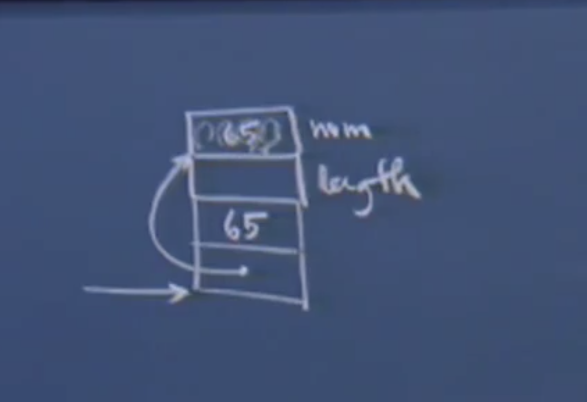

# Lec 13 

主要内容

1. 头文件对于编译和链接的影响
2. 运行时崩溃的原因
3. 缓冲区溢出

## 头文件对编译和链接的影响

```cpp
#include <stdio.h> 
#include <stdlib.h> 
#include <assert.h> 


int main(int argc, char** argv)
{
    
    void* mem = malloc(400); 
    assert(mem!= NULL); 
    printf("Yay!\n");
    free(mem);
    return 0; 
}

```

```shell
gcc main.c 
```


程序生成汇编代码，并由链接器进行重组。这个例子中只有一个.o文件，其他部分来自于编译器标准库或标准的.o代码，标准的编译器会提供printf，malloc, free, realloc, fprintf以及类似函数对应的.o代码进行链接。通常编译器会将一些必要的代码一个接着一个放置，生成一个更大的可执行文件。并且去掉那些没有用到的部分。但是一定会保留那些在执行过程中可能出现的函数。并且可执行程序在运行时应该能够跳转到程序的任意位置。

程序会通过编译，正常执行，打印出Yay！，并且作为副作用，程序会首先申请400字节的缓冲区空间，确保它申请成功了，然后打印消息，释放掉它并返回0.这意味着它会很快地打印出Yay，malloc和free函数可以成功的调用并且能够正常工作。

小的改动会对编译和链接产生怎样的影响？ 

### 注释掉<stdio.h> 

```c
//#include <stdio.h> 
#include <stdlib.h> 
#include <assert.h> 


int main(int argc, char** argv)
{
    
    void* mem = malloc(400); 
    assert(mem!= NULL); 
    printf("Yay!\n");
    free(mem);
    return 0; 
}
```

这样会产生编译错误吗？即使编译器看不到printf函数的原型。

答案是：对于部分编译器来说是正确的，会产生编译错误。

将这一行注释掉，那么预处理器生成的翻译单元中将不会有printf的声明。因此编译器检查printf函数是否被正确调用的时候，它会发现之前并没有看到这个函数的声明。这时多数的编译器会报错说:我没有见过这个函数原型，因此我没有办法调用那些没有见过原型的函数，所以我只能报错了！

**gcc：函数原型推导**

但是例外的是，gcc就不会报错，gcc会在编译时刻分析源程序，看看哪一部分看起来像是函数调用，他会根据这个函数调用来推测函数的原型。

编译器看到这里只有一个字符串作为参数，然后会发出一个警告，因为没有见到函数原型，但是它并不会停下来，还会继续生成.o文件。只要最终的这个函数原型是这个的话，这个函数掉用就没有错误。只要你至少传入一个字符串，printf就没有语法错误。并且在这个调用中没有占位符。因此也不会出现运行时错误。

当gcc根据调用来推测一个函数原型的时候，默认地会将返回类型推测为int，碰巧printf的返回值的确是int类型。通常我们不会用到这个返回值，但是实际上这个返回值等于成功匹配的占位符的个数。对于这次调用来说会返回0，因为没有占位符。但是在这里我们并不关心返回值，而是关心返回类型。这个返回类型碰巧和gcc编译器推测的一致。

现在，如果在这个printf调用之后，还有一些printf调用的话，他们只能拥有一个参数，因为printf的函数原型是推测出来的，它与实际的函数原型还是稍微有区别的。

```c
int printf(const char *restrict format, ...);	//实际的函数原型
int printf(char*);					// 推测出来的函数原型
```

既然可以通过编译，那么生成的.o文件会是怎样的呢？

实际上完全没有变，这个.h只是包含结构的定义以及一些原型。对它来说不会产生任何的汇编代码，它的作用是告诉编译器一些规则，让编译器可以判定程序的哪些部分语法是正确的，哪些部分语法是错误的。不过当它推导这个函数原型时，编译器会在编译阶段发出一条警告来告诉程序员，但它还是会让`SP = SP -4`并且将字符串"Yay!/n"的地址拷贝到`M[SP]`中，并且依然会`CALL<printf>`并且希望通过RV来传递函数的返回值，虽然很可能会将这个值忽略掉，这样使用gcc可以得到这个.o文件。

会有一半的同学会认为在链接阶段，命令会终止，因为链接器并没有发现程序中包含printf的定义。每当你使用gcc创建可执行程序的时候，实际上在链接阶段会使用链接命令ld，让链接器来完成这个过程，链接器会根据编译过程中出现的警告来查找标准库，printf对应的代码就在标准库中，因此在链接阶段会被加进来。即使在链接之前，我们并没有看到过它的原型。因此#include并不能保证相应的函数实现在链接时可用，如果某个函数定义在标准库中，那么在链接时就可以被加进来。无论我们是否声明了函数原型。


### 注释掉#include <stdlib.h> 

```c
#include <stdio.h> 
//#include <stdlib.h> 
#include <assert.h> 


int main(int argc, char** argv)
{
    
    void* mem = malloc(400); 
    assert(mem!= NULL); 
    printf("Yay!\n");
    free(mem);
    return 0; 
}
```

那么现在就没有了malloc 和 free 的函数原型了，再次编译程序的话，在处理时遇到malloc调用，但是并不知道malloc究竟时什么。但是我们这里的写法看起来像是函数调用，因此编译器会将这个推测为一个函数，并且推测函数有一个int类型的参数，int类型的返回值。

```c
void *malloc(size_t size);	// 实际的函数原型
int malloc (int); 	// 推导出的函数原型
```

编译器并不会查看赋值语句来推测返回值的类型，因此它会对这一行报出两个警告：

1. 没有看到malloc的函数原型
2. 根据推测出的函数原型，这是对void* 类型的指针赋值了int类型

但是到了free这一行。编译器同样不知道它是什么，因为没有看到它的函数原型，于是编译器推导它的原型，并报出一条警告，然后指出它推测的free原型是什么，它假设free的参数是`void*`（因为传入的参数是`void*`类型），并且返回值是int，虽然并不是这样，但是我们并没有对返回值进行任何操作,因此这样推导没有问题。

```c
void free(void *ptr);	// 实际的函数原型
int free(void*);	// 编译器推导的原型
```


然后编译器继续分析下面的内容，生成的.o文件与之前的并没有任何的区别。（原因同上），只是它在这个过程中会报出3个警告信息：两条是因为没有看到函数原型，而一条是因为左值和右值的类型不兼容。

但是仍然会完成编译过程，然后在链接阶段，ld会忘掉这些警告，编译器并没有记录说这里没有包含某个头文件，也不会记录在编译时刻存在某些警告，只是运行的话会有一点危险，但是生成的.o文件与你写的这段代码语义是完全一致的。

所以当链接并且运行这个程序的时候，这个程序并不会产生什么问题。

Q&A 为何注释掉了还会得到正确的a.out并执行

问题在于编译器并不能理解为什么会正确执行，其实头文件做的全部事情就是告诉编译器有哪些函数原型，但在.h文件中并没有说明这些函数的代码在哪里。链接阶段则负责去标准库中寻找这些代码，而malloc, free, 和 printf正是在标准库中，这就好像由于#include 的存在，让.o文件有了一些钩子（这些钩子用来联系标准库代码），只要这些函数在标准库中出现，无论在编译时有无警告，生成的可执行文件中都会包含这些，因此在链接的时候就可以用到标准库的代码，并且将调用到的函数的代码加进来，因此会在.o文件中出现相应标号的函数，生成可执行文件.o

而且，在这个例子中没有自定义的printf和free

如果将上面的两行都注释掉，会产生4条警告信息，但是依然会生成.o文件，并且会链接生成a.out, 在运行的时候

### 注释掉<assert.h> 

```c
#include <stdio.h> 
#include <stdlib.h> 
//#include <assert.h> 


int main(int argc, char** argv)
{
    
    void* mem = malloc(400); 
    assert(mem!= NULL); 
    printf("Yay!\n");
    free(mem);
    return 0; 
}
```

如果在代码中没有提及assert这个符号在编译单元中是什么的话，当编译器分析到这一行的时候会说：我不知道assert是什么，编译器会猜测它是一个函数调用, 因此在.o文件中会出现`CALL <assert>`这样一条指令，整体通过编译，但是在链接的时候会失败。

失败的原因是，虽然标准库中有很多的函数实现，如printf, malloc, free 因为它们都是真正的函数，但是在标准库中却没有assert，因为assert是一个宏，不是函数。

所以正是这样的原因才需要原型：函数原型的存在是为了让调用者和被调用者关于savedPC上面的活动记录布局达成一致（也就是让函数的调用参数符合参数类型规定），原型其实只涉及函数参数，参数在活动记录中位于savedPC之上，而在savedPC之下的那些内容，是被调用者来负责的。

当我们调用printf，并跳转到printf函数对应的代码时，我们需要确保活动记录中上半部分的信息格式对于调用者和被调用者而言时一致的。因为调用printf的时候，我将一个字符串常量的地址作为参数，然后让被调用者接管并且继续执行。

printf会接管执行并且说：根据函数原型我认为在savedPC的上方是一个字符串，因为这个函数中我就是这么规定的。如果不是字符串，那恐怕就要出问题了。如果是字符串，那我就将它打印出来。

### strlen的例子

```c
int main()
{
    int num = 65; 
    int length = strlen(&(char*)&num,, num); 	//	诡异的方式进行调用
    printf("length = %d \n", length); 
    return 0; 
}
```

编译器看到这一行会发出警告，因为没有函数原型,它会将参数推导为(char* ,int)，返回值为int ,因为对所有未知的原型。

```c
size_t strlen(const char *str);	// 真实的函数原型
int strlen(char*, int);	//	 推导出来的函数原型
```

如果这个代码编译的话，编译器只会报出一条警告。不过这个函数`strlen`调用出错了，标准库的strlen其实只有一个字符串参数。

活动记录



调用strlen时相应地会创建活动记录，并为调用参数预留空间，但是其实这里是推测的原型，因此编译器在编译的时候会认为：ok，虽然我不知道我调用的是什么，但是根据这个调用，应该执行`SP = SP - 8	`,然后将num的地址放到SP，由于使用了强制类型转换，所以编译器会将它视为字符串。并且将65放到SP + 4处。

你可能会认为在链接阶段会出现错误，因为链接是会发现strlen应该只有一个参数，实际上并不是这样：在.o文件中并未记录下某个调用有多少个参数。

当然我们可以看到在.o文件中SP= SP- 8；而不是4，这样以来可能会觉得需要的参数个数，但实际却并不是这样。实际上，如果是16个字节的话，其实也有可能是一个16字节的结构体变量，或者4个整数。

因此，在链接的时候，gcc只会考察符号名称，而不会检查形参类型。

在链接阶段，虽然函数调用和函数签名匹配不上，但是链接阶段不会管它，链接阶段做的事情只是查找strlen的定义。

在运行时，会从这个位置跳转到strlen，strlen会接着这个活动记录继续执行，真正的strlen实现中其实只有一个char*类型的参数。因此相应的汇编代码只会对这部分进行操作，


并且strlen能够操作的只有这一部分的内存，这个函数中有for循环，并且将返回值放到RV中。为什么这里的65就被忽略了呢？因为strlen只有一个char* 参数，并不能访问到65所在的位置。

因此这段代码能正常通过编译，并且会报出一条警告，如果想去掉警告的话，可以手动将编译器推导出的原型声明为函数原型，这样编译器进行检查的时候就会认为没有问题了。

```c
int strlen(char*, int);	// 在最前面手动声明原型

int main()
{
    int num = 65; 
    int length = strlen(&(char*)&num,, num); 	//	诡异的方式进行调用
    printf("length = %d \n", length); 
    return 0; 
}
```

这和经过预处理之后的翻译单元的样子看上去差不多，因此如果我不想要编译器发出警告的话。只需要手动添加一个原型即可，这意味着我知道这个原型是什么，所以我才这样调用它。

很多时候你会看到别人只是手动添加函数原型，因为通过#include会添加一个很大的,h文件，这样会导致编译很慢。大量的#include的确会影响编译的时间。很多时候都是手工添加原型，而不是将头文件中所有内容都包含进来。但是这样做有点危险，因为从技术上来说写错这种事情时有发生。这样编译出来的并不是你想要的代码。但是在编译的时候并不会有任何问题。

但是在调用strlen的时候只会考虑这段弧线下面的内容，而且只能将这个位置解释为char*，在返回的时候该函数会给length赋值，然后打印这个值。

在little-endian机器上，输出1，这里的65就是字符‘A'。


在big-endian机器上，输出0，strlen认为这个指针指向的是栈中的空字符串。


还是尽量不要手写原型，而是使用#include头文件的形式，原型的错误会发生上述的事情。

这个例子并没有造成任何运行时错误，原因在于num是65，无论是big-endian还是little-endian，strlen都不会越界。因为会遇到0，哪个都可以解释称c的字符串序列。解释的结果是 0或者“A”。虽然程序看起来很诡异，但是可以输出正确的结果。

Q&A 

strlen对应的函数原型，实际的strlen只能访问它上面的4个字节，而且最多只能访问saved PC 上面的4个字节。值就保存在这里，而且当strlen返回的时候，这段空间还是会被回收，只是strlen的实现决定了它并不能访问这4个字节的空间。调用者`SP = SP -8`	,它认为65会在strlen的代码中用到。在执行结束的时候，它也会将这块内存回收。

### 另一个相反的例子

```c
int memcmp(void* v1); 	//写错了的函数原型

int main()
{
    int n = 17; 
    int m = memcmp(&n); 	//只传入一个参数会怎样？
    
    return 0; 
}
```

实际的函数原型

```c
int memcmp(const void *s1, const void *s2, size_t n);
```


首先声明变量并赋值为17； 

然后是m；

编译时我们认为memcmp最多只能访问saved PC上面的4个字节，这意味着只有一个参数，但是当我们把控制权转移给真正的memcmp的时候，实际memcmp的实现是能够访问上面的12个字节，即实际的函数原型有3个参数。

它会将saved PC上方的3*4字节分别认为是s1, s2, 和n，然后根据这三个参数执行，得出结果，这样的调用并不合理，但是实际的调用过程就是这样。

程序会编译通过，并且可以运行，但是很可能会在运行时刻崩溃掉，因为m中的内存没有经过初始化是随机的4个字节，因此不太可能是一个合法的栈/堆/代码段 指针。所以memcpy很容易会访问到非法的内存位置。

### c 和 c++ 函数签名

c语言程序很容易通过编译，并且难以置信的是，即使通过了编译，在运行的时候也会报错。C++是一个完全强类型的系统，所以并不知道裸指针void* 还有类型转换之间的关系。所以如果想要正常运行，在编译之前还要做一些额外的工作。当习惯了使用C++中的模板之后，就不会经常使用c语言中void* 的泛型了，虽然在c++中，编译程序会很痛苦，但是正是由于类型检查的机制，相比而言编译号的C++程序更不容易崩溃。

通过使用C++中的模版和模版容器，你会更少的和指针打交道，所以在执行程序的时候更不容易遇到程序崩溃的情况，但是在C程序中总会遇到程序崩溃的情形。现在我们应该对此有深刻的认识～

> C++编译器像是个极度挑剔的婚礼筹划，只有当一切就绪的时候才会让婚礼开始；对于C编译器，只要都能用它会说，哦这是个`void*`, 那里也是个`void*`不过只要你知道你自己要做的是什么的话，我都会觉得这没有问题并且执行下去，如果出了问题，那就是你的问题了。

C++编译器对纯C的扩展就做不到这样。

**C++中的函数重载**：

只需要定义同名函数并且形式参数类型列表与之前的不同就可以了，你甚至可以定义两个参数个数完全相同的函数，只要他们的顺序不同即可，只要根据函数签名和函数操纵的对象就可以区分这两个同名函数的版本。

编译器允许你这样做，但是在纯C中并不可以，如果我已经有了名为memcmp的函数，那么我只能使用这个名字1次，不能再定义这个函数了。这一点C++就很聪明，当它编译的时候并不会使用函数名作为该函数第一条指令的标号，**实际上它会使用函数名和参数列表中的参数的数据类型按照参数顺序来构造一个更加复杂的函数符号。**

```assembly
CALL <memcmp> 						# c style 
CALL <memcmp_void_p> 				# c++ style
<memcmp_void_p_void_p_int>		# c++ style 实际定义
```

你依然可以调用那些在C++的库中有定义的各个函数名，但是在链接的时候由于调用函数的符号和实际的函数符号不符，于是会产生链接错误（找不到`memcmp_void_p`的符号定义）。

因此从这个角度来讲，c++似乎更加安全。

## 运行时崩溃

一些简单的小例子，分析程序为什么会崩溃。对于程序崩溃来说，并不是多有趣并且多有深意，更应该研究的是为什么程序会崩溃。

是段错误，还是总线错误？

为什么程序通过了编译和链接阶段，还会在运行阶段出错呢？

两个程序崩溃时常见的非常讨厌的警告：

1. segment falut
2. bus error

这两个错误都是在对错误的指针进行解引用的时候出现的。但是由于情况不同所以原因也不一样。

### 段错误

```c
*(NULL); // 程序不能通过编译，因为你不能对void*类型解引用

int *p = NULL;
*p; 	// segment falut
```

如果你尝试跳转到NULL对应的地址，去找一个int* or char*的话，执行时会报出一个段错误。之所以会出现段错误是因为NULL对应的地址不再任何段中，操作系统可以识别出它：你要对NULL进行解引用操作，但是操作系统并没有将地址0映射到栈，堆或者代码段数据段中，这样做不可能是对的，因为你访问的是非法的区域，这个地址不是某个局部变量的地址，也不是堆中的地址，那么你为什么还要对它进行解引用操作呢？对于这种情况，我只能发出一个段错误。

段错误的原因：你对一个并没有映射到段中的地址进行解应用时发生的。

### 总线错误

总线错误通常出现在你对一个确实映射到这4个段中的地址进行解引用时发生的。操作系统认为你解引用的地址实际上并不是你想要的地址。

```c
void *vp = somevalue;	// vp的值是四个段中的某个地址
*(short*)vp = 7; 		// 50%的概率得到一个总线错误
*(int*)vp = 55;			// 75%的概率得到一个总线错误
```

如果vp的值时这四个段中的某个地址的话，程序就不会出现段错误，因为这个地址就在段内。

但是系统希望更简单的处理，编译器支持硬件和操作系统规定的某个限制，这个限制规定所有的整形数据对应的地址都应该是4的倍数，并且short数据类型变量对应的地址都应该是偶数地址。而对字符类型并没有什么限制。但是考虑到简洁和硬件优化，编译器假设出了short类型和char类型的变量外，其他类型变量首地址都是4字节对齐的(aligned)。

如果vp的值是奇数地址的话，硬件会认为出现了总线错误，因为硬件不希望将奇数地址当作short类型的首地址，因为它知道编译器是不会将奇数地址作为short类型变量的首地址的。

同理，vp的值不是4倍数的话，`*(int*)vp = 55;`也会导致总线错误。int类型的地址应该都是4的倍数对齐的。 

总线错误的原因：硬件和操作系统的限制


## 缓冲区溢出

### 复杂的while(true)

```c
#include <stdio.h>

int main(int argc, char** argv)
{
    int i; 
    int array[4]; 
    
    for(int i = 0; i < 4; ++i)
    {
        array[i] = 0; 
    }
    
 	return 0;     
}
```

抽象内存模型：函数的的调用返回方式和实际的内存模型是很相似的。


这个启动函数负责将命令行中的argv字符串数组的内容进行统计，计算出这些字符串的个数，将这个结果作为argv参数传递给main函数。

循环继续进行，条件判断为true然后执行array[4]=0，在上面的内存布局中即将0写入了变量i；所以我们会得到一个dead-loop; 就这样，程序会不停的进行赋值操作。这是i因为所有的变量都在内存总紧密的排列。 

这种现象从技术上叫做缓冲期溢出。会让程序出现问题。

tips：编译器为了防止越界默认开启一个编译选项进行栈保护，即不会让array 和 i 之间相邻。但是这一保护可以通过配置编译选项取消。

### Little-endian or big-endian

```c
#include <stdio.h>

int main(int argc, char** argv)
{
    int i; 
    short array[4]; 
    
    for(int i = 0; i < 4; ++i)
    {
        array[i] = 0; 
    }
    
 	return 0;     
}
```

**内存布局**


在big-endian系统中，可以正常结束循环并退出。


在little-endian系统中，会出现dead-loop


### 更高级的infinite-loop

```c
void foo()
{
    int array[4]; // 这次array是在i上面的
    int i; 
    for(i = 0; i <= 4; ++i)
    {
        array[i] -=4; 
    }
}
```

 

这次缓冲区溢出导致修改了savedPC的值,原本正确savedPC值应该是`CALL <foo> ` 的下一 句，然而-4操作让它又指向了`CALL<foo>`，这样在foo返回时又跳转到了这里，于是在返回后只是再次调用foo函数。然后函数执行并返回，还是修改了savedPC的值，如此循环调用foo函数。

实际上就是这样：程序会不停地跳到foo的地址，并且由于缓冲区溢出，每次执行foo都会将savedPC的值-4，这意味着变成了它前一条指令，因此这个程序是一个更高级的死循环。某种程度上来讲是一个无限的递归，在foo函数调用的末尾，又再一次调用了foo本身。