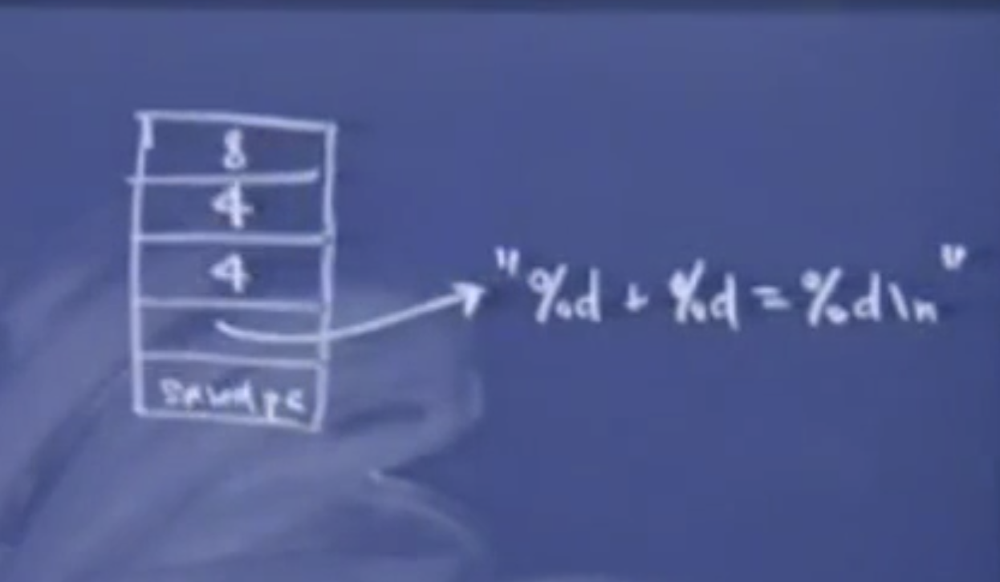
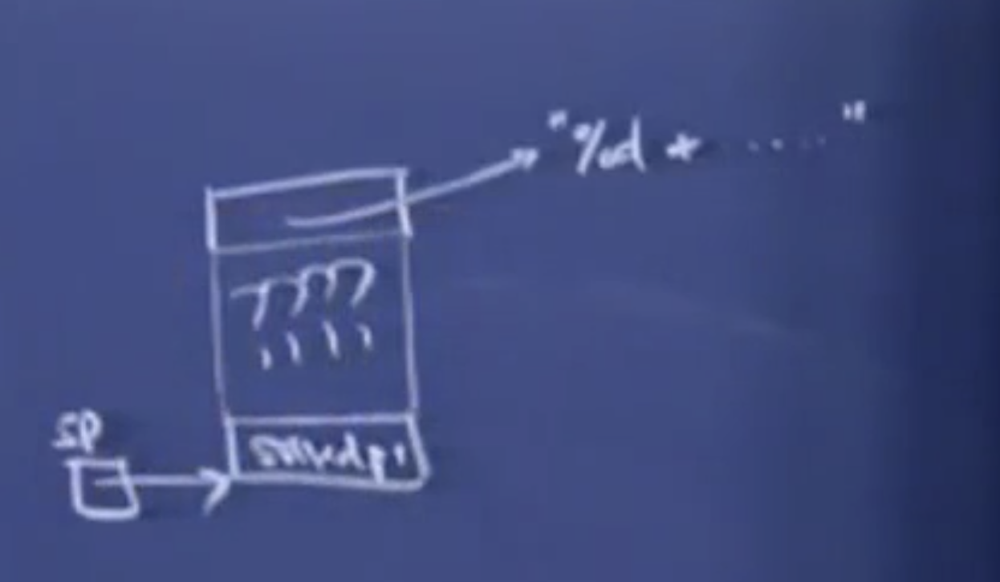
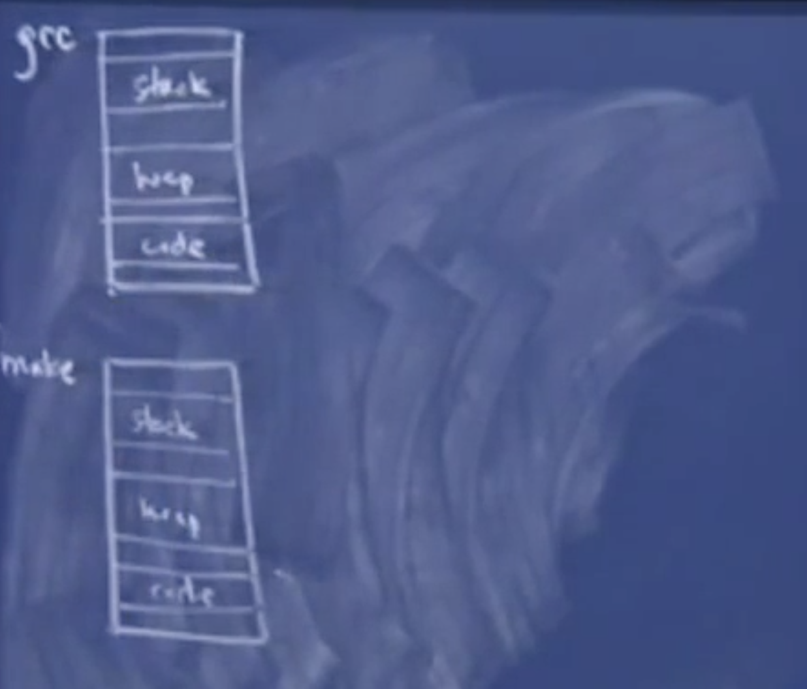
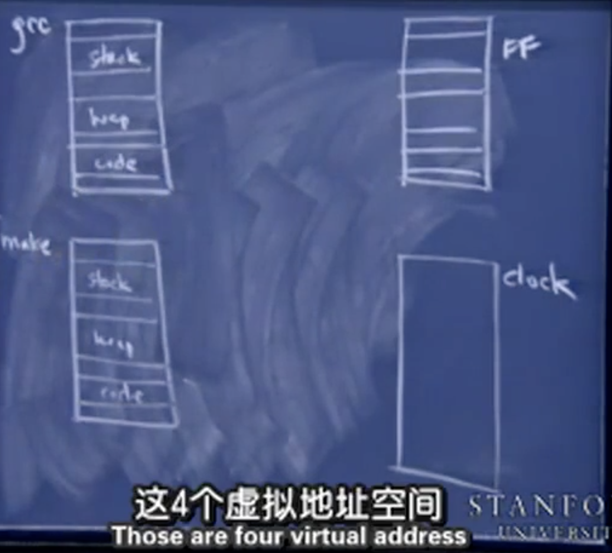
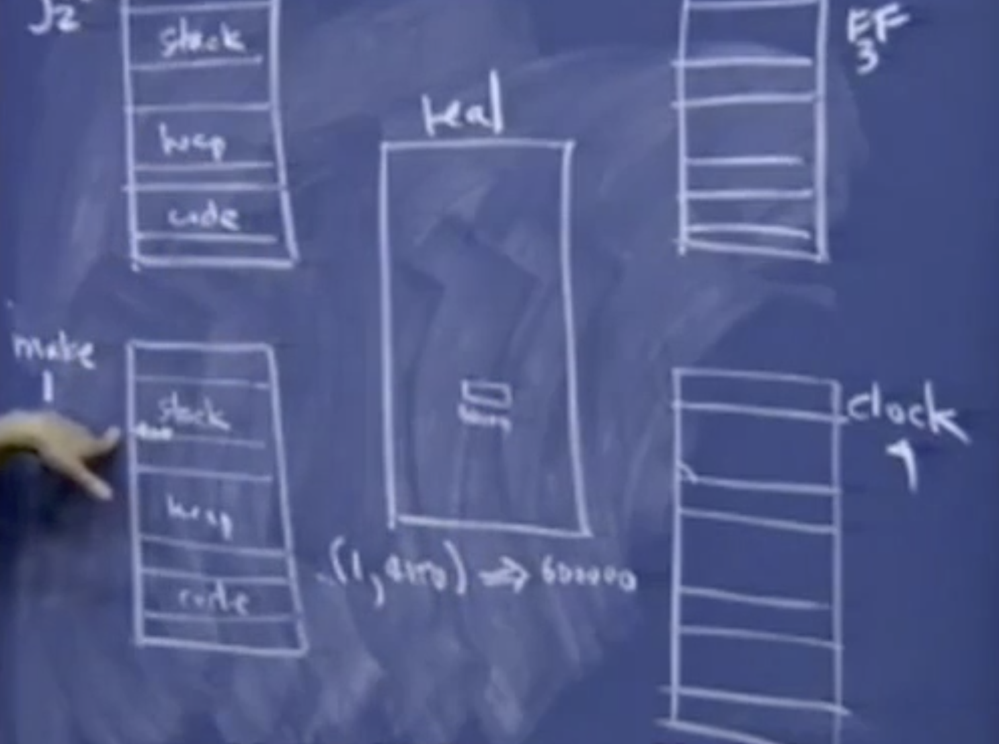

# Lec 14 

1. Channeling
2. printf
2. struct
2. 进程切换 


## Channeling

```c
void foo() 
{
    int array[4]; 
    int i ; 
    for(i = 0; i <= 4; ++i)
    {
        array[i] -= 4; 
    }
}
```

陷入死循环的原因：缓冲区溢出导致修改了savedPC的值，将savedPC值-4，将本该指向`CALL<foo>`下一条语句的saved PC指向了`CALL <foo>`	当函数返回时，又执行了`CALL<foo>`.实际上是一种递归。

在solaris的内存模型比我们讲到的要复杂一些。它们并不是让savedPC与这些变量直接相邻，不过也不会差太多。

```c
int main(int argc, char**argv)
{
    DeclareAndInitArray(); 
    PrintArray(); 
}


// 短小却很优美的代码，但是对作用域外没有任何贡献
// 404 字节的活动记录
void DeclareAndInitArray()
{
    int arr[100]; 
    int i; 
    for(i = 0; i < 100; i++)
    {
        array[i] = i; 
    }
}

// 
void printArray()
{
    int array[100]; 
    int i;
    for(int i = 0; i < 100; ++i)
    {
        printf("%d \n", array[i]); 
    }
 
}
```

没有全局变量的参与，两个函数之间如何交互信息呢？虽然我们不喜欢全局变量，但它依旧是在函数调用间交换信息的一个合法途径。但是这里并不支持全局变量。程序也不认为它需要全局变量。

结果是可以正常输出DeclareAndInitArray() 初始化的数组。

DeclareAndInitArray() 有404个字节的活动记录，array数组占据了上面的400字节，变量i占据了最下面的4个字节。经过系列操作之后，函数返回。然后调用了另外一个函数printArray(), 它的活动记录与之前调用的函数的活动记录完全一样。这个函数的活动记录同样包含了404字节。 并且打印出之前的函数操作之后留在内存中的数据的值。等同从结构相同的活动记录中访问同一块内存。

因为当上一个函数返回的时候，并不会对使用过的内存进行reset，清空这里的位模式。因为执行这个操作时要花费时间的。

这在以前是一种高级的技巧，但是现在我们的程序不一定是顺序执行的。

11year ago 对于每个硬件中断，你都要执行一小段代码，但是中断的小周期中，能做的事情太少了。因此必须在下一个周期中再做一些事情。事实上，对于中断里面要做的事情并没有那么多的时间来完成相应的处理逻辑。因此很多时候你需要提前准备好这些信息。每次都是直接使用它们，而不是再次去生成它们。

可以认为是奇怪且讨巧的全局变量。可以提前将参数写到内存中位以后的调用做准备。

如果你在DeclareAndInitArray之后直接调用了printf函数，那么我们构造的0-99序列将不能被正常访问。然后有人可能会将DeclareAndInitArray函数注释掉，以为是printf的问题，但实际上并不是这样。

有经验的C++程序员会利用内存布局来使用这种技巧。

## printf

 Printf 的函数原型，怎样的函数原型才能支持可变参数呢？无论如何，我们总是需要一个控制字符串(control string)作为控制台输出的模版，因此printf的第一个参数是const char*。 但是接下来就没有任何确定的参数类型，甚至有些时候不需要其他的参数，这样就更没有所谓的数据类型可言。

这个不确定数据类型的函数参数为 `...`，这说明什么类型都可以传进来作为参数，这样编译器就可以接受任意个数及各种类型。

这个函数的返回类型为int，值是成功解析的占位符的个数。

```c 
int printf(const char *restrict format, ...);
```

典型的函数调用

```c 
printf("Hello/n"); 	//这和cout << "Hello\n"<<endl 不同。 返回 0 
printf("%d + %d = %d\n", 4, 4, 8);	// 2⃣️ 返回 3
```

2⃣️：如果你想这样调用的话，当然是没问题的。但是从编程语言的角度来讲，printf既可以只有一个参数，也可以有4个参数，理论上它其实可以有1到任意多个参数（取决于栈的大小）。

第一个参数是一个字符串："%d + %d = %d\n“，里面指明一些数据类型，等待后面的参数进行填充。

编译器不会对这些参数进行任何的类型检查，首先传入一个控制字符串之后，你可以传入任何类型进来。指针，结构体都可以作为参数进行传递。

Gcc曾经在很长一段时间对C语言规范进行了一定程度的扩展，它会尝试对占位符和后面传入的参数进行类型检查，校验类型是否匹配。这样会在编译时刻更加花费时间，这样的目的是确保printf能够正常工作。

```
printf("%s + %s = %s\n", 4, 4, 8);	
```

多数编译器会通过编译，并且执行该程序，但是这样会产生运行时错误。但是GCC会警告你：可能你并不想要这样调用。

通常printf的调用不会出错，但是scanf调用却很容易出错，如果由于某种原因这里出错了的话，回返回-1。而C++的ifstream在遇到错误时会设置fail flag, 并且调用fail()时会返回true。这样你就会停止从文件中读取数据。调用scan和fscanf时如果遇到文件末尾会返回-1.

之所以提到这个函数原型是因为，根据我们现有的知识，以及本课中提到的内存模型。可以解释参数的传递规则:从右向左依次入栈，以及为什么第0个参数会在最下面，以及第一个参数会在它上面。

**内存模型**

编译时根据函数原型，上面两个printf的调用都是合法的，但是在对第二个printf进行编译时，编译器会计算参数个数，并且计算出需要让栈指针减去多少个字节来为参数分配空间。因此栈帧大概是这样的。




 第一个函数调用的栈帧只有一参数，指向字符串"Hello\n"。因此实际上在saved PC 上面的活动记录大小实际上与参数的个数和参数的类型有关。当我们执行到printf时。函数并不知道在char* 参数上面还有多少个参数。

由于printf的实现使用了特殊的记号，因此它允许栈中的参数可以动态变化，通过分析控制字符串中占位符的个数和类型来知道需要匹配的参数的位置，以及大小。所以printf总是需要一个控制字符串作为参数，它会逐字符地分析它，并且每当读取到`%d`的时候，它会说：“根据分析的结果可以知道，控制字符上方的4个字节应该被解释为`int`类型"。之后它又遇到了一个`%d`, 它会说：“在int上方还有一个int类型“。通过这样分析printf将占位符对应的内容找到。如果没有占位符的话，这里就是一些printf不能解析的未知内容。如果这个控制字符串写的有问题【语法错误】：如果传入了三个字符串的话，这里的内容应该是3个char*，这一工作是由调用者完成的，然后在执行时，它们会被解释称4字节的整数。因此无论这些字符串的地址是多少，它们都被解释成`unsigned int`类型，并将它们填充到这三个占位符对应的位置中。

这与我们将参数压入栈的顺序一致：从右到左。假设栈指针指向saved PC,但是控制字符串位于其他参数的上方，这时候对于printf("Hello")没有任何影响，但是，对于有占位符的控制字符串来说，？？？对应的区域占据了12字节，这样就没有一个可靠的方式找到“road map“ 来解释活动记录中的其他参数了。



一旦你理解了其中的原理就能知道可变参数`...`,c语言制定这样的规范更有利于编译器的实现。因此希望编译器能够支持`...`.这中写法。C++也是这样处理的，这也是出于兼容C语言的考虑。Java后来也引进了这种写法。如果不读取额外的数据的话，只能通过这种压栈顺序来实现。

Pascal并没有这种省略写法，你必须制定参数的个数，它将参数压栈的顺序与C的相反。但是实现起来也没有问题。可以按任意顺序压栈，因为对这门语言来说，不会遇到不确定参数大小的情形（struct）。 

## 结构体

Code 只可能是1or 2 ，用来当成操作码，用来指定指令，编码数据，或者指明内存中code上方的内容。

```c
struct base 
{
    int code; 
}; 

struct type_one
{
    int code; 	// 1
    ...; 
}; 

struct type_two 
{
   int code;  	// 2
}; 
```

可以将这个看成是一些设备的定义。你可以将这两类指针转换成struct base* 类型，只要它们与struct base 类型相一致，你知道这里有一个op code 或者说是type code在内存布局的相同位置。以便得到不同的信息。

一个更复杂的例子是，这个例子中有更多的结构体。gcc和g++提供了很多结构体来进行网络管理。其中就涉及了这样的操作。

Ipv6 位了兼容ipv4，它的前半部分与ipv4版本的结构体是一样的。而后半部分则是一些额外信息 ，想要知道你使用的结构体是什么版本时，通过分析这个变量的前几个字节就可以知道：“这个结构体是ipv4的还是ipv6的“ 

这个例子解释了为什么结构体的第一个变量必须为最低地址，这不是必须的，但是大多数编译器是这样实现的。因为实现者都提前考虑到了。如果不这样做，都放在最高地址，我们就不知道这部分与整个结构体变量接地址的的距离了。

你可能会争论将code作为结构体的最后一个部分，这样也可以实现，但是代码应该以一种简单的方式被设计规范和设计编译器的人理解。将第一个变量的偏移量设为0的话，可以用c和c++的结构体写出更巧妙的代码。


## 进程切换

迄今为止我们讲到的所有C和C++的内容都是顺序执行的。使用线程技术可以让第四次作业中执行速度比以前快很z多。

**如何让两个进程看起来像是在同时运行呢？**

即如何让两个程序看起来像是在同一个处理器中同时运行，然后根据这个思路，来思考怎样让一个进程中的两个函数看起来同时运行。

**虚拟地址空间** 



虚拟的意思是这段地址空间可以无限长。 

make 实际上它就是一个应用程序，它会读取名为makefile的数据文件，指出怎样调用gcc 和g++以及链接器和优化程序这些工具来生成可用并且可执行的程序。

stack heap code segment

当make开始运行时，gcc这个程序可能会运行好几次。gcc也是一个可执行程序，第一个C语言编译器2是使用汇编写的，然后有那个对原来编译器自举的方式来构建更加复杂的编译器。

汇编代码并不会存放在实际内存中相同的地方，他们不会共享堆栈，更不会共享代码段。虚拟地址空间让make程序认为自己占有着所有的内存执行动作，操作系统管理器会将这部分虚拟地址映射称为实际地址，另一部分地址也是被影射了。操作系统通过地址映射来隔离各个程序。造成各程序独占硬件的假象。




 四个虚拟地址空间对应的进程看起来好像同时处于活跃状态，它们都假定有足够空间来建立一个足够大的栈，但是在单处理器的电脑上，只有一段内存，对应实际所有物理内存。





根据这些代码运行的程序，都存储在这些可执行文件中。虽然各个段它们有着相同的虚拟地址，但是它们对应的物理地址是完全不同的（地址隔离），操作系统要做的是调用内存管理单元（MMU）。主要用来建立一个表格。里面记录了虚拟地址和物理地址之间的映射，它实际上建立了一个进程和有关地址的表格。并且将它映射到内存中的一个真实的地址。

```shell
[1, 4000] -> 600000 
```

比如说将进程1的虚拟地址映射到了物理地址600000；任何操作和处理地址4000的请求都被转化为处理物理地址600000。任何形式的加载存储或者访问都被这个在幕后的守护进程所代理或者管理。MMU总是在后台运行，来进行虚拟地址和物理地址的映射。并且它知道这个地址4000是进程1所拥有，所以它只是有这个信息映射。
