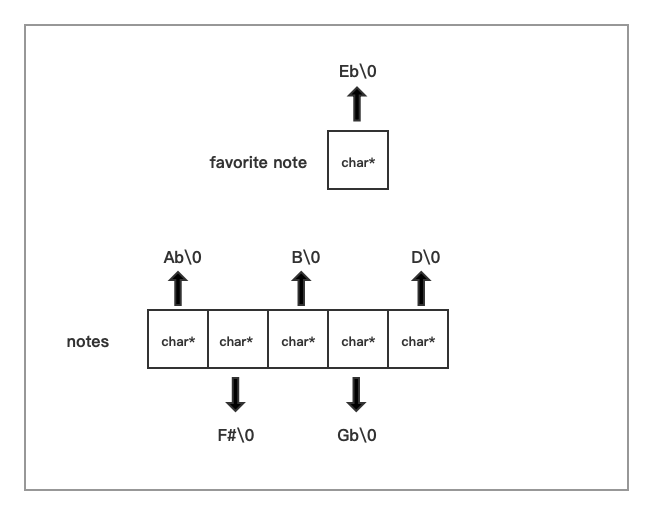

# Lec 4

## 1. Generic Pointer

Generic Pointer : void * 并不是说没有类型，而是指向没有任何类型信息的某个东西。

## 2. Generic Programming

### 2.1 swap 

​	变量的类型 `int`隐式地指明了变量在内存空间中占用的大小。

```c
/* 轮转换位 */ 
void swap(int *ap, int *bp)
{
  int temp = *ap; 
  *ap = *bp; 
  *bp = temp; 
}
```

只能使用这个函数进行int类型的交换。

如何实现一种函数可以实现两个相同内存大小的变量进行内存交换的操作？

```c
/* Generic pointer  */
void swap(void* vp1, void* vp2, int elemSize)
{
  	char buffer[size] = {0}; // gcc 支持
  // void *temp = malloc(elemSize); 
  	memcpy(buffer, vp1, elemSize);
  	memcpy(vp1, vp2, elemSize); 
  	memcpy(vp2, buffer, elemSize); 
  
  // free(temp); 
}
```

1. 不能声明temp类型的变量，因为机器不知道为这个变量分配多大的内存空间。
2. void* vp1, void* vp2没有体现任何的类型信息。
3. 第三个参数的意义是显示地说明变量的布局（内存中占用的空间）。
4. 与C++中的模板相比，上面这段代码对于不同类型调用产生的汇编代码是一样的，当使用模板的时候，模板会有很多的好处。但是在编译时会根据设定进行扩展，生成int类型的swap，或者double类型的swap等。实际上时扩展成了两个代码的独立版本。如果类型很多的话，会造成代码膨胀。
5. C语言提供的最好的方式。
6. 编译器不会对void* 做任何检查，很容易就可以编译通过。

### 2.2  swap char**

```c
int x = 17;
int y = 37;
swap(&x, &y, sizeof(int));


double d = 3.1415; 
double e = 2.732;
swap(&d, &e, sizeof(int)); 

// problem 编译器可检查不出来void* 的错误
int i = 44;
short s = 5;
swap(&i, &s, sizeof(short)); 

char *husband = strdup("Fred");
char *wife = strdup("Wilma");

// correct 交换两个char* 变量中的内容
swap(&husband, &wife, sizeof(char*)); 

// wrong, but won't crash, macOS is 64 bits -> 8 bytes swaped 
swap(husband, wife, sizeof(char*)); 

// wrong, 
swap(husband, &wife, sizeof(char*));
```

- correct 


- Wrong but won't crash 


- Wrong and probably crash


当我们通常写代码将类型弄混时，编译器总是会提示我们可能存在问题。除非在使用void* 类型时。编译器无法知道类型是什么，这样也就没法进行类型检查。 

### 2.3 lsearch 

**void* 失去了与类型相关联的隐式指针算术运算, 编译器也不知道如何比较它们指向的内容**。

#### 2.3.1 int  

```c
int lsearch(int key, 
           int array[], 
           int size)
{
  	
    for(int i = 0; i < size; ++i)
    {
        if(array[i] == key) // 指针算术运算 	-> *(array + i) 编译器会自动乘上sizeof(int)
        {
            return i; 
        }
    }

    return -1; 
}
```

#### 2.3.2 generic 

1.function poniters -> call back/ hook function .

memcpy 对于内置类型有效，但是如果是字符串数组呢？ 我们如果想要比较数组中的元素指向的字符串是否相等呢？这就是cmpfn的作用，**判断相等的规则由调用者来指定**。

2. **calculate the address manually.** 难点在于保证指针运算都正确

```c
void *lsearch(void* key, 
  					 void* base, 
             int n, 
             int elemSize, 
             int(*cmpfn)(void*vp1, void* vp2))
{
  	void* elemAddr = NULL; 
  	for(int i = 0; i < n; ++i)
    {
      	elemAddr = 
          (char*)base + i*elemSize; //语法上想要实现的话要使用char* 步长为sizeof(char) = 1
      		if(cmpfn(elemAddr, key) == 0)
          {
            	return elemAddr; 
          }
    }
  	return NULL; 
}

/* int type  */

int array[] = {4,2,3,7,11,6};
int size = 6; 
int number = 7; 

int intCmp(void*vp1, void* vp2)
{
  	/* 调用者提供的函数，它知道void* 应该被解释成int* 类型 */
  	return  *((int*)vp1) - *((int*)vp2); 
  
}
int * found  = lsearch(&number, array, 6, sizeof(int), intCmp); 
if(found == NULL)
{
  	; 
}
else
{
  	; 
}

{
  	
}
```

- fast
- one copy of code
- best way in C for generics, 35 years ago.

#### 2.3.3  eg. char**

要比较的是字符串是否一致。

请注意vp1, vp2 被解释成了什么类型，为什么？

对称性。



```c
/* char* type */
char * notes[] = {"Ab", "F#", "B", "Gb", "D"};

int stringCmp(void*, void*);
char * favoritenote = "Eb";
char **found = lsearch(&favoritenote, notes, 5, sizeof(char*), stringCmp);

int stringCmp(void *vp1, void *vp2)
{
  	char *s1 = *(char**)vp1;
  	char *s2 = *(char**)vp2;
  	return strcmp(s1, s2);
}

```

#### 2.3.4 bsearch

```c 
void *bsearch(void *key, void* base, int n, int elemsize, int(*cmpfn)(void*, void*));

int (cmpfn)(void*, void*); 
// 现代语法分析器和语义分析器能够正确识别这是个函数指针，以前是必须加上*才能被正确识别。
```

void* 可以传入任何类型指针，只要cmpfn知道该如何正确解释这个地址，并提供相应的比较机制。


# Lec 05 

通用数据结构

- 没有引用
- 没有模版
- 没有类的概念


## 1.1 Generic Stack


