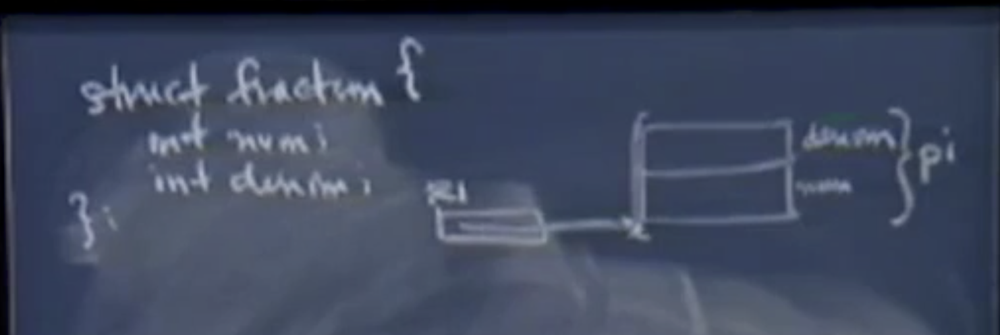

## Lec 9 计算机体系结构和汇编语言

主要内容：

- 计算机体系结构
- 汇编语言
- 内存模型
- CS107 中使用的汇编语言
- 强制类型转换的作用


## 1. 理解汇编指令

**源代码**1

```c
int i; 
int j; 

i = 10; 		// 1
j = i + 7; 		// 2
j++;  			// 3 
```

**活动记录**


R1 是一个通用的4字节位模式寄存器 generic 4-byte bit pattern register, 在这里用来记录活动记录的基地址。

我们现在关注管理i, j 地址访问的汇编代码。假设这两个变量的基地址，存储在一个特殊的专用寄存器中。

**汇编代码**

```assembly
# 1
M[R1 + 4] = 10; 		//   M 将内存视为一个非常大的数组M， R1是基地址，4为4字节偏移量，指定了基地址开始的4字节写入数据10 store operation 将栈中某个区域的值进行了更新

# 2  
R2 = M[R1 + 4]; 		// load operation R2 中存放的其实是变量i 的值
R3 = R2 + 7; 			// ALU operation 两个寄存器，或者一个寄存器和一个常量 结果由等号左边的寄存器维护， R3中的位模式应该拷贝到变量j对应的栈空间中,j 的地址由R1 偏移得到

M[R1] = R3; 			// store operation 将j 对应的值进行更新

# 3 复用R2 寄存器
R2 = M[R1];				// load operation 
R2 = R2 + 1; 			// ALU operation
M[R1] = R2; 			// store operation

```

这种load-ALU-Store形式差不多在所有c/c++面向赋值的语句中都是这样.

默认load,  ALU, Store操作处理的都是4字节的数据。

​	c/c++: 指针和int是编程中最常使用的原子类型。硬件对于这两种类型的操作【4字节内存的存取】进行了优化。这里并不是说对于其他长度类型(char, short, double)等内存进行存取。而是我们对于4字节操作的各类指令更加感兴趣。

**关于2**

```assembly
# 2  
R2 = M[R1 + 4]; 		// load operation R2 中存放的其实是变量i 的值
R3 = R2 + 7; 			// ALU operation 两个寄存器，或者一个寄存器和一个常量 结果由等号左边的寄存器维护， R3中的位模式应该拷贝到变量j对应的栈空间中,j 的地址由R1 偏移得到
```

为什么不直接写成

```assembly
M[R1] = 10 + 7; 
```

​	编译器希望将所有汇编代码语句都与源代码语句一一对应。并且以一种上下文无关的方式表现出来，而不是hardcode。这样即使将语句1中的值改变，语句2对应的汇编代码仍然能够正常运行。如果使用hardcode, 如果将语句1 中的常量修改，那么M[R1] = 10 +7将不能得到正确的结果，意味着语句2 也要重新生成。

**关于3**

为什么不直接使用 M[R1] ++ ? 

这里的汇编指令不允许任意内存地址作为ALU类操作运算符的操作数。

我们必须总是先要使用load操作将值读进寄存器，然后使用ALU运算符进行算数运算，最后使用store将结果更新到相应内存对应的区域。

这将使得汇编指令变得简单。并且指令简单时，始终频率也会变快。


**源代码2**

```c
int i ; 
short s1; 
short s2; 

i = 200; 	// 1 
s1 = i;		// 2 
s2 = s1 + 1; // 3 

```

**活动记录**


看起来有些奇怪，不过因为s2是三个声明中的最后一个。根据内存模型，它应该是对应着最低的基地址。

```assembly 
# 1 
M[R2 + 4] = 200; 

# 2
# 如果这么写？ 2.1
M[R1 + 2] = M[R1 + 4]; 

# 2.2 
R2 = M[R1 + 4]; 
M[R1 + 2] = R2; //	load, ALU, store 操作默认都是4字节的 默认是个.4 

# 2.3 
R2 = M[R1 + 4]; 
M[R1 + 2] = .2 R2; 	// 将寄存器低2bytes内容更新到s1对应的内存地址中。这种情况使用.2 显式地指明

# 3 
R2 = .2 M[R1 + 2]; 		// load s1
R3 = R2 + 1; 			// ALU 
M[R2] = .2 R3;			// store 
```

**关于语句2.1**

1. 不可以在一条指令中同时进行load and store：因为你要将汇编语言以某种方式编码成4字节，编码内存操作数的源地址，内存操作数的目的地址。（32位编码做不到）

**关于语句2.2**

2. Load, ALU, store 操作默认是4字节的，这意味着汇编代码访问到了C/C++ 代码中并没有的空间。

**关于语句2.3**

通用内存可以看成一个非常大的数组，不过默认情况下，每块都是4 字节的。

Tips：Q&A

在每个例子中使用的寄存器不同，有的是为了保留寄存器。如果预料到在有的例子中会使用很多个寄存器，会尽可能节约地使用它们。

**源代码3**

尝试对长度为10的数组进行一些操作。for 循环如何翻译成汇编代码。

```c
int array[4];
int i; 

for(int i = 0; i < 4; i++)	// 1
{
    array[i] = 0; 			// 2 
}
i--; 						// 3 
```

与c代码一样，汇编代码也是按照次序顺序执行完成的。

如果一门语言拥有循环结构，那么在汇编语言中毫无意外的要有执行跳转任意长度的指令，这些指令用来一起执行循环体。

If, switch 语句则根据测试结果决定是否要向前跳转指定长度。到else 从句或者某个特殊的case语句然后执行它们。

6 个关系运算符: <, <=, >,  >=, ==, != 对应 BLT, BLE, BGT, BGE, BEQ, BNE.

在大多数汇编语言中存在典型的分支指令，它根据这6种关系运算符的结果决定是否跳转。

硬件会确保当前活动记录的基地址，存储在某个特定的寄存器中。暂时用R1 来表示

```assembly 
# 1 i = 0; 
M[R1] = 0; 

#2 测试表达式，根据结果来决定是否执行循环体。
R2 = M[R1]; 
BGE R2, 4, PC + 40 ;						// 前两个参数是寄存器或者常量，第三个参数表示跳转的位置,如果测试失败就跳过1条C代码, 执行i--; 就仿佛循环不存在一样。PC + 某个偏移量【语句条数 * 语句宽度4】
# loop 循环执行的语句
R3 = M[R1]; 
R4 = R3 * 4; 	// 4 = sizeof(int), 在所有汇编中都要计算类型的大小 在汇编层面上没有类型，大小信息。汇编代码通过4这个值与c/c++代码保持一致，得到正确的结果 R4 是 offset 
R5 = M[R1 + 4];			//	 R5 是array 的基地址
R6 = R5 + R4;			//   R6 == &array[i];
M[R6] = 0; 				// 	 array[i] = 0; 
# 3 i++ 
R2 = M[R1]; 			//   i++
R2 = R2 +1; 
M[R1] = R2; 
# 4 
JMP PC - 40;			// 跳转到 测试表达式
# i-- 			
R2 = M[R1]; 
R2 = R2 - 1; 
M[R1] = R2; 
```

**关于PC寄存器**

PC 寄存器： 现在处理器PC通常是第27，29 或者第31号寄存器。PC means program counter 它存储当前执行指令的地址。默认情况下PC会对自己的值 +4, 用来执行下一条指令。因为这里所用的汇编指令都是4字节宽度。所以默认情况下，在执行完当前指令后自动执行下一条指令。除非遇到跳转指令，或者是分支指令，这时就不会自增。了。

**关于测试表达式**

此时不知道 2 会翻译成多少条汇编代码，所以将跳转的指令先空着，等下翻译完再填上。但是我们可以知道这个偏移量是一个正数，并且是4的倍数。 

**关于循环体中的数组赋值**

指针算数运算翻译成汇编代码

找到数组种第i个元素的地址，然后写入数据0。c语言中隐式地将i * sizeof(int) ，在汇编中这种乘倍需要显示计算。

在编写汇编时要时刻注意数组的偏移量要对数组的基地址加上i*sizeof(int)。

要注意显式指针算数运算。

**关于循环的实现JMP 语句**

循环中的语句执行完毕后需要跳转到测试表达式的位置进行判断是否还要继续循环。

**无条件跳转JMP 和 有条件跳转BXX语句**


**Tips**：Q&A

Q: 这段代码中实际上是可以JMP PC -36 直接执行测试表达式，在R2已经保存了i的前提下。

A: 可以这么做，因为R2中正好保存了i的值。但是希望能够养成上下文无关的汇编代码写法，这样总是正确的。

Q： 是否所有汇编指令都是32bits

A:  是的，4byte width。


**理解指令编码**

```assembly
R1 = M[R2 + 4]; // 1. load  000000
R1 = 1000; 		// 2. ALU 	 000001 
R3 = R6 * R10;	// 3. ALU   010011
M[R1 - 20] = R19; 	// 4. store  111111 maybe 
```

我们要将59种不同的指令编码到4字节中。59并不是2的整数次幂。所以至少要提供6bits来存放指令，硬件将要检查这个区域中的值来获取要执行的指令类型。这个区域存放的值被称为操作码 op code.

 硬件会在时钟周期的前一部分，查看前六位是什么。然后再决定怎样解释剩下的26位。

假设op code 对应着语句1 


前6位是操作码，5位是等号左边的寄存器编号，5位是等号右侧基地址寄存器的编号。剩下16位存放常量。

这种解释只有op 是 000000的时候有效，其他情况按照操作码具体值来决定如何解释，这里使用了定长编码，更容易获得指令信息。

哈夫曼编码：定长编码 & 变长编码【MIPS】


## 2. 指针和强制类型转换



​	这块空间逻辑上对应的就是变量pi，在本课程中，寄存器R1 存储的就是这个变量的基地址，并且知道这个变量怎样拆分成更小的原子类型。


```c
struct fraction
{
  	int num; 
    int denum; 
};

int main(int argc, char** argv)
{
    struct fraction pi; 
    pi.num = 22; 				// M[R1] = 22; 
    pi.denum = 7; 				// M[R1 + 4] = 7;
    
    (struct fraction*)(&pi.num)->denum = 451;  // M[R1 + 8] = 451; 
    
}
```

​	在汇编中，可以忘掉它是结构体类型，而是在操纵结构体中的各个成员域。

```c
pi.denum = 7; 				// M[R1 + 4] = 7;
```

​	强制类型转换的作用：不将pi.num的地址当作int类型变量的基地址，而是将它当作struct fraction类型的基地址。通过这个地址将并不存在的denum域赋值为451.

​	通过指针求值这个地址，然后强制转换为fraction类型的基地址，最后将451放到对应便宜的位置。实际上只需要一条汇编语句就可以做到。

```c
 (struct fraction*)(&pi.num)->denum = 451;  // M[R1 + 8] = 451; 
```

​	pi.denum 对应的偏移应该是R1 + 4, 整个变量在内存中的地址。由于我们将这个地址强制转换成了 fraction* 类型：这并不会改变地址实际的值，而是改变了编译器对这个地址的认知。

​	这样来在解引用并访问denum域的时候，编译器因此能知道应该访问的位置。

​	因此无论使用人工翻译还是使用代码生成，编译器通常会发现R1距离目标位置的偏移量为8.

​	对于C语言而言，汇编中是没有与强制类型转换相对应的代码的。

​	**强制类型转换的作用是允许编译器能够绕过类型检查的机制而通过编译产生汇编代码**

 	注：C++则不像C语言这样静态。
